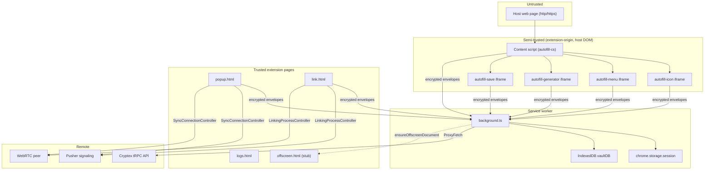

# Architecture Overview

Cryptex Vault is a Manifest V3 browser extension. The service worker is the
trusted root: it holds decrypted vault material while unlocked, owns the Online
Services JWT, and gates every privileged operation through encrypted envelopes.

## Realms

| Realm            | Entry             | Trust                               | Can message SW?               |
| ---------------- | ----------------- | ----------------------------------- | ----------------------------- |
| Service worker   | `background.js`   | Root                                | N/A (handler)                 |
| Action popup     | `popup.html`      | High                                | Yes — full vault ACL          |
| Link tab         | `link.html`       | Medium-high                         | Yes — OS + proxy only         |
| Logs tab         | `logs.html`       | Low                                 | No                            |
| Content script   | `autofill-cs.js`  | Semi — top frame only               | Yes — autofill ACL            |
| Autofill iframes | `autofill-*.html` | Semi — extension origin in host DOM | Yes — per-kind ACL            |
| Offscreen        | `offscreen.html`  | Reserved                            | Plaintext `GetPublicKey` only |

## Three parallel stacks

1. **SW envelope bus** — All vault mutations, autofill secret release, and tRPC
   proxying flow through ECDH-encrypted envelopes validated by origin and message
   type. See [service-worker/messaging.md](../service-worker/messaging.md).

2. **Online Services JWT** — Passkey-backed session token stored in
   `chrome.storage.session` (`OS_SESSION`). Established on unlock or link
   receive; cleared on lock or system idle. UI never holds the JWT directly.
   See [sync-and-link/online-services.md](../sync-and-link/online-services.md).

3. **Pusher + WebRTC** — Shared web sync/link code runs in popup and link
   extension pages. Vault data crosses into WebRTC only through SW sync message
   handlers. Offscreen document is provisioned for future background WebRTC but
   is not wired today. See [sync-and-link/README.md](../sync-and-link/README.md).

## Shared web code

The extension build aliases `@` to `../web/src`. Vault encryption, Dexie
persistence, sync wire protocol, and link-receive logic live in the web package
and are reused unchanged where possible. Extension-specific bridges:

- `trpc-ext.ts` — routes tRPC through SW `ProxyFetch`
- `auth-session-ext.ts` — SW-owned JWT lifecycle
- `VaultOperations` in `vault-view.tsx` — SW sync message bridge

## Storage split

| Layer                    | What                                       | Lifetime                              |
| ------------------------ | ------------------------------------------ | ------------------------------------- |
| IndexedDB `vaultDB`      | Encrypted vault blobs, ECDH key pairs      | Persistent                            |
| `chrome.storage.session` | Decrypted vault, DEK, OS JWT, pending save | Browser session; cleared on lock/idle |
| `chrome.storage.local`   | Diagnostic logs (`extLogs`)                | Persistent until cleared              |
| `localStorage`           | Last-selected vault index (popup unlock)   | Persistent; non-secret                |

See [platform/persistence.md](../platform/persistence.md).

## Reading order

1. This overview
2. [Service worker messaging](../service-worker/messaging.md)
3. [UI surfaces](../ui/README.md)
4. [Sync and link](../sync-and-link/README.md)
5. [Platform layer](../platform/README.md)
6. [Autofill security](../autofill/README.md)
7. [Threat model](../threat-model.md)
