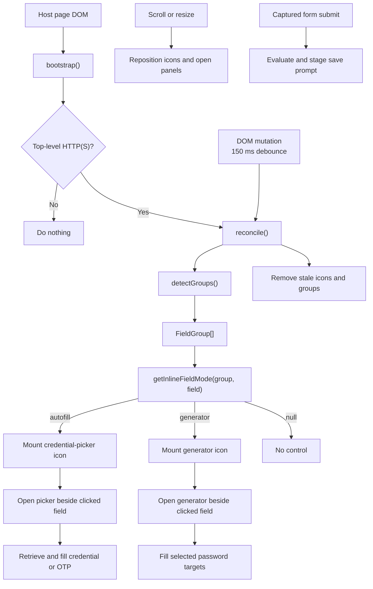
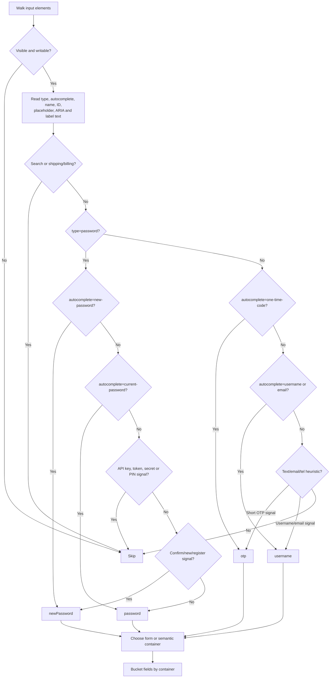
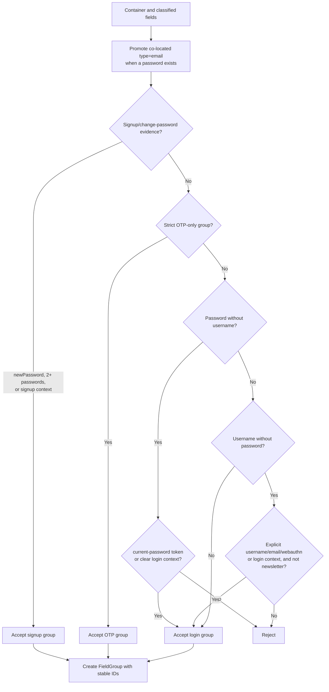
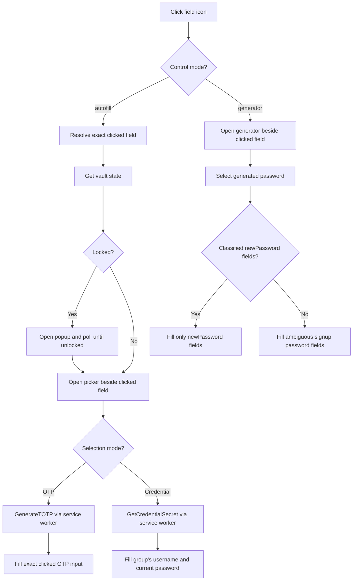
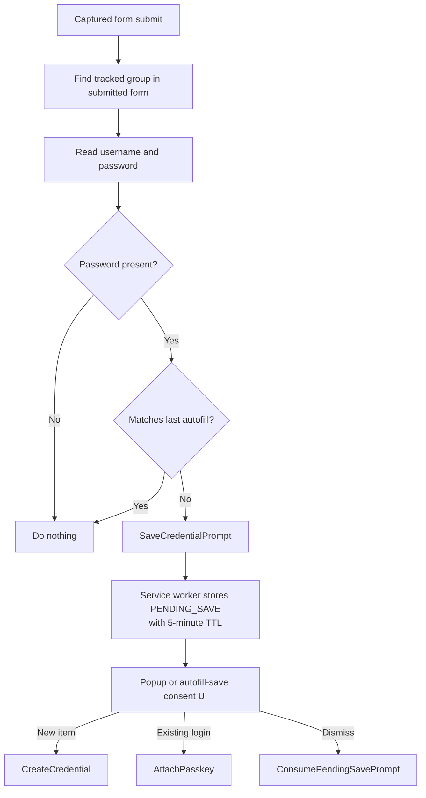

# Content Scripts

The extension injects an isolated-world autofill bundle and a small main-world
WebAuthn bridge on all `http:` and `https:` pages.

## Manifest injection

```
js: assets/autofill-cs.js (IIFE, vite.config.content.ts)
matches: http://*/*, https://*/*
run_at: document_start
all_frames: false
match_about_blank: false
```

## Runtime gating (`autofill-cs.ts`)

Before bootstrap:

- `isTopFrame()` — refuses subframes (cross-origin `window.top` access failure → false)
- Protocol must be `http:` or `https:`

Service worker enforces `sender.frameId === 0` for `autofill-cs` origin
(`security-utils.ts`). Sub-frame content scripts cannot message SW as autofill-cs
even if injected.

## Autofill subsystem flow

`field-detector.ts` converts the host DOM into stable field groups and assigns
an inline-control mode to each qualified field. `autofill-cs.ts` reconciles that
model with extension iframe UI and owns interaction, filling, repositioning,
cleanup, and save-on-submit.



## Field detection (`field-detector.ts`)

Detection walks the document and open shadow roots; closed shadow roots are not
accessible. It does not read input values. Values are read later only for fill
and save handling.



Explicit password autocomplete tokens are intentionally evaluated before
name-based secret-field exclusions. Attribute and label heuristics are secondary
evidence.

### Group qualification



Field and container `WeakMap` caches preserve IDs across SPA rescans. The group
`anchor` is only a preferred representative; inline controls bind to individual
fields.

### Development diagnostics

Development content-script builds print one collapsed console group per
`detectGroups()` scan:

```text
[Cryptex autofill] field scan: <icons>, <accepted without icon>, <rejected>
```

The group contains separate console tables for accepted and rejected inputs.
Rows show a non-value element description, type/name/ID/autocomplete metadata,
field classification, group identity, the matched classification and group
reasons, and the final `icon:autofill`, `icon:generator`, `accepted:no-icon`, or
`rejected` result. Input values are never read or included in diagnostics.

`vite.config.content.ts` replaces
`globalThis.__CRYTEX_FIELD_DIAGNOSTICS__` with `true` for development builds and
`false` for production builds. Diagnostics currently have no runtime opt-in in
production.

### Per-field inline controls

Controls are mounted per qualified input rather than once per group. The menu
opens beside the exact clicked field and uses that field's classification.

| Field context                                        | Inline control                | Result                                                                   |
| ---------------------------------------------------- | ----------------------------- | ------------------------------------------------------------------------ |
| Username, email, or current password in a login flow | Credential picker             | Fills the matching login group                                           |
| OTP                                                  | Credential picker in OTP mode | Generates and fills the exact clicked OTP input                          |
| `new-password` in signup/change-password flow        | Password generator            | Fills only the group's classified new-password fields                    |
| Current password alongside `new-password`            | Credential picker             | Preserves the existing password while new-password fields use generators |

If a signup group contains multiple password fields but none can be classified
as `new-password`, generator controls remain available as a compatibility
fallback and fill those password fields together.

### Picker and generator interaction



The picker panel position, reported field kind, OTP mode, and OTP target all
come from the clicked field rather than the group anchor. Normal credential
selection intentionally fills the matching group.

### Field control lifecycle

Detection records every qualified field, but only the active field gets a
control. Focus or pointer interaction moves the single control to that field.
Blur removes it after the browser settles focus, unless its picker or generator
is still open.

The control lives in a closed shadow root and contains no vault data. It is
positioned against the field's viewport rectangle, reserves enough input
padding to keep text clear, and shifts away from existing site controls. The
original padding is restored when the control moves or closes. Resize,
scroll, transition, and animation events keep the active control and panel in
place.

## Injection model

The content script owns the lightweight field control in its isolated world. It
uses extension-origin iframes only for panels with their own UI and message
channel:

| Iframe                    | Purpose                  |
| ------------------------- | ------------------------ |
| `autofill-menu.html`      | Credential picker        |
| `autofill-generator.html` | Password generator       |
| `autofill-save.html`      | Save-login consent panel |

The iframe URLs come from `chrome.runtime.getURL()` and are web-accessible
resources. The field control is not web-accessible.

### Bootstrap handshake

Before loading an iframe, content script registers `{ mountId, nonce, kind }`
with SW (`RegisterAutofillFrame`). Iframe claims nonce (`ClaimAutofillFrame`).
Parent→iframe `init` over `MessageChannel` requires matching `mountId` + `nonce`.

Nonce never appears in iframe URL (only `cryptexMountId`). Host page can race
mount IDs (DoS) but cannot learn nonce or bind port. See
[autofill/iframe-bootstrap.md](../autofill/iframe-bootstrap.md).

## SW messaging from content script

Origin: `autofill-cs` (explicit override via `setEnvelopeOriginOverride`)

Allowed encrypted messages: see [service-worker/messaging.md](../service-worker/messaging.md).

Sensitive paths:

- `GetCredentialsForOrigin` derives the page URL from the content-script sender.
- `GetCredentialSecret` / `GenerateTOTP` repeat the shared URL policy before
  releasing secrets.
- `SaveCredentialPrompt` stashes the password in session storage for 5 minutes.
- `GetState` reveals vault locked/unlocked state to a top-frame page.

## Save-on-submit flow



## Code review map

| Area               | Primary function/state                 | Review concern                                                         |
| ------------------ | -------------------------------------- | ---------------------------------------------------------------------- |
| Classification     | `classifyInput()`                      | Precedence of explicit metadata, exclusions, and fuzzy hints           |
| Group boundaries   | `groupContainer()` / `detectGroups()`  | Unrelated fields grouped together or valid fields separated            |
| Control policy     | `getInlineFieldMode()`                 | Picker versus generator assignment                                     |
| DOM reconciliation | `reconcile()` / `trackedFields`        | Stable field tracking, stale cleanup, and SPA field-role changes       |
| Picker binding     | `openMenuForIcon()` / `menuActiveIcon` | Panel position and behavior follow the active field                    |
| Secret fill        | `fillFromCredential()`                 | OTP targets one field; credentials fill the group                      |
| Generated fill     | `selectGeneratedPasswordFields()`      | Current passwords are never overwritten when new-password fields exist |
| Save handling      | `shouldPromptSave()`                   | Correct field selection and suppression of unchanged autofill          |
