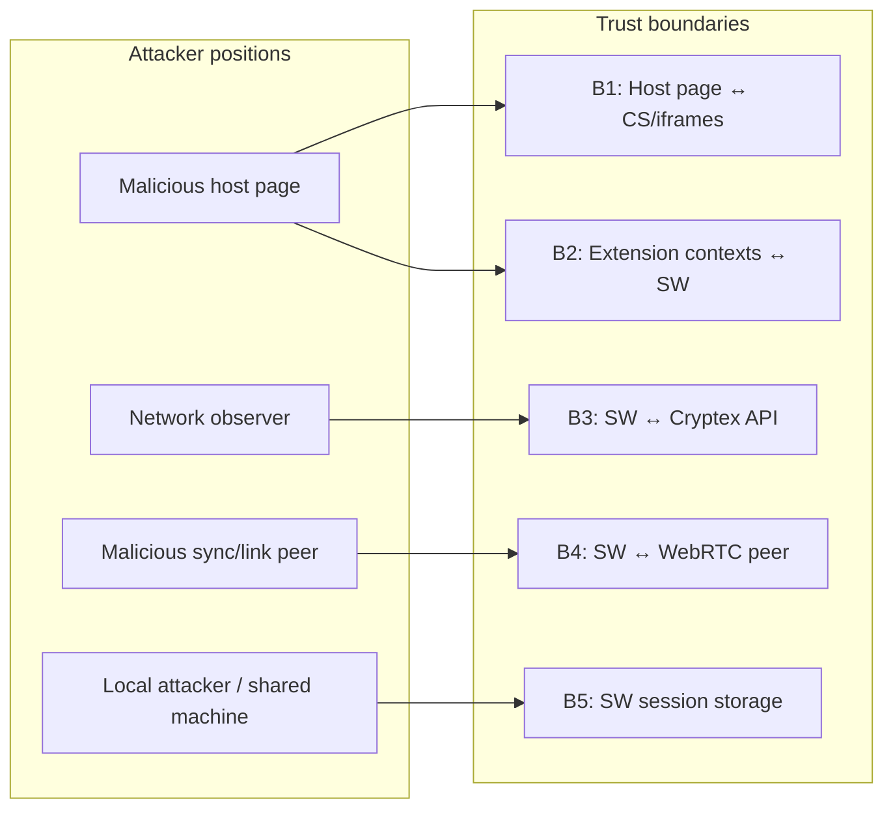
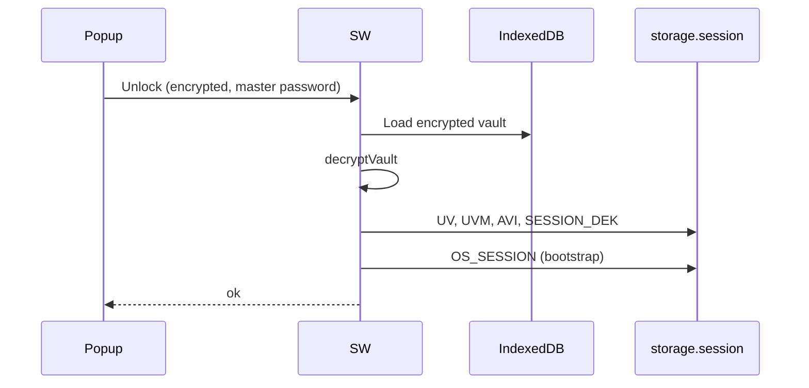
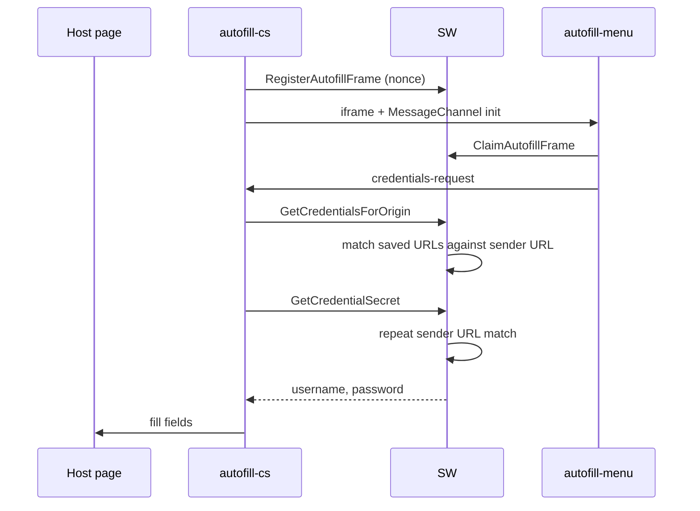
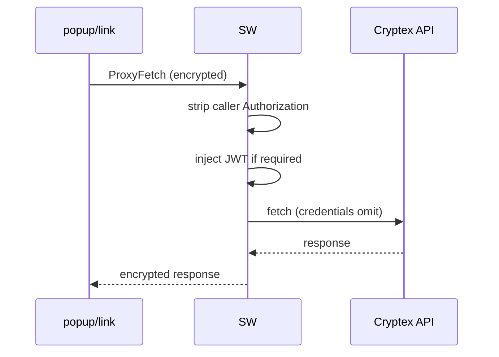

# Extension Threat Model

This document describes trust boundaries, assets, attackers, controls, and
residual risks for the Cryptex Vault browser extension. It synthesizes the
architecture docs under `extension/docs/`.

## Scope

| In scope                                                                          | Out of scope                                       |
| --------------------------------------------------------------------------------- | -------------------------------------------------- |
| MV3 extension (SW, popup/full-page vault, link, content script, autofill iframes) | Cryptex web app (separate codebase)                |
| Local vault storage and session                                                   | Backend API compromise (assumed honest tRPC + TLS) |
| Autofill on host pages                                                            | Physical device compromise (assumed out of band)   |
| Sync and link over Pusher/WebRTC                                                  | Malicious browser or OS (assumed honest Chrome)    |

## Assets

| Asset                         | Location while at risk                                  | Impact if exposed                                       |
| ----------------------------- | ------------------------------------------------------- | ------------------------------------------------------- |
| Master password               | Encrypted in Unlock envelope; ephemeral in popup memory | Full vault decryption                                   |
| Vault DEK                     | `chrome.storage.session` `SESSION_DEK:*`                | Decrypt vault blob at rest                              |
| Decrypted vault               | `chrome.storage.session` `UV`                           | All passwords, TOTP secrets, notes                      |
| Credential secrets (autofill) | CS → SW → fill path; pending save in session            | Per-credential exposure                                 |
| Credential form draft         | `chrome.storage.session` `DRAFT_SAVE` (SW-owned)        | Typed form data incl. new/changed password/other fields |
| Online Services JWT           | `chrome.storage.session` `OS_SESSION`                   | API access as device                                    |
| Device signing key JWK        | `OS_SESSION`, vault `OnlineServices`                    | Re-auth without user gesture                            |
| ECDH messaging private key    | IndexedDB `keyPairs` (non-extractable)                  | Decrypt captured envelopes                              |
| Mnemonic (link receive)       | Link page memory during flow                            | Decrypt link package                                    |
| Diagnostic logs               | `chrome.storage.local` `extLogs`                        | Metadata leakage (deviceId, vaultId, errors)            |
| Clipboard                     | OS clipboard after copy actions                         | Credential field exposure                               |

## Trust boundaries

### B1 — Host page ↔ content script / autofill iframes

**Trust assumption:** Host page is hostile. Content script runs in isolated world
but shares the DOM.

**Controls:**

- Top-frame only (`all_frames: false`, `isTopFrame()`, `frameId === 0`)
- Iframe bootstrap nonce registered in SW; host cannot learn nonce or hijack
  MessageChannel ([autofill/iframe-bootstrap.md](autofill/iframe-bootstrap.md))
- Exact, domain, and wildcard credential release rules ([autofill/origin-matching.md](autofill/origin-matching.md))
- WAR limited to autofill HTML + assets (not popup/link/logs)

**Residual:** Host can DoS autofill (mount-id race, remove iframes). Host can
probe `GetState` (locked/unlocked). Host can trigger `SaveCredentialPrompt` with
arbitrary data (user must confirm in save UI).

### B2 — Extension contexts ↔ service worker

**Trust assumption:** Extension pages and CS are semi-trusted; SW is root of trust.

**Controls:**

- ECDH per-request encryption with SW long-term key
- Origin URL validation per context
- Per-origin message type allowlists ([service-worker/messaging.md](service-worker/messaging.md))
- Replay protection (ULID `requestId`, ±2 min timestamp)
- Link origin restricted to proxy + OS only ([ui/README.md](ui/README.md))
- ProxyFetch strips caller `Authorization`
- Draft messages (`Get/Save/ClearCredentialDraft`) popup-allowlisted; SW shape-validates the untrusted form payload and staleness-checks edit drafts against the live vault (credential exists, not deleted, `Version` unchanged) before re-presentation

**Residual:** Full vault in session while unlocked — any SW bug or extension
compromise is total loss. `worker` origin binding is weak (public key only).
Response envelope validation not implemented. Replay cache resets on SW eviction.

### B3 — Service worker ↔ Cryptex API

**Trust assumption:** API is honest; TLS protects wire.

**Controls:**

- tRPC URL allowlist on configured app origin
- GET/POST only; `credentials: omit`
- JWT owned by SW; UI cannot inject auth headers

**Residual:** Compromised API or DNS hijack on dev wildcard host permissions.
Mitigated in production by narrowed `host_permissions`.

### B4 — Extension ↔ sync/link peer (Pusher + WebRTC)

**Trust assumption:** Signaling infrastructure may be observed; peer may be malicious.

**Controls:**

- Pusher channel auth via proxied tRPC + JWT
- PQ KEM + signing handshake on sync sessions
- AEAD on sync and link vault transfer payloads
- Link package encrypted with mnemonic (never on wire)

**Residual:** Signaling MITM can disrupt or metadata-probe sessions; app-layer
crypto mitigates payload disclosure but does not remove signaling trust.
`SyncUpdateCredentials` merges inbound credentials without deep schema validation.

### B5 — Session and local persistence

**Trust assumption:** Browser session storage is confidential within the browser profile.

**Controls:**

- Lock + idle clear all session keys
- DEK `TRUSTED_CONTEXTS` access level
- Vault encrypted at rest in IndexedDB
- Credential form draft (`DRAFT_SAVE`) session-scoped: cleared on lock, idle lock, browser shutdown, successful save, and explicit user discard

**Residual:** Unlocked vault is plaintext in `chrome.storage.session`. Malware with
browser profile access reads `UV`. Pending save holds password up to 5 minutes.
Form drafts hold typed (possibly new/changed) passwords for the whole unlocked
window (up to 30 min idle).
Logs persist device/vault metadata to `chrome.storage.local`.

## Attacker models

### A1 — Malicious website (top frame, user has extension installed)

**Goals:** Steal credentials, probe vault state, inject saved logins, disrupt autofill.

| Technique                                    | Control                    | Residual risk                                                   |
| -------------------------------------------- | -------------------------- | --------------------------------------------------------------- |
| Request secrets outside configured URL rules | Shared URL rule matcher    | Low — blocked                                                   |
| Abuse a broad domain or wildcard rule        | Explicit per-rule mode     | **Medium** - user-approved scope may include a compromised host |
| Request secrets for an authorized phish host | Sender-derived URL recheck | **Medium** - works when a saved rule authorizes that host       |
| Probe vault locked/unlocked                  | `GetState` from CS         | Low — metadata only                                             |
| Hijack iframe MessageChannel                 | SW nonce bootstrap         | Low — blocked                                                   |
| Stash fake login for save prompt             | `SaveCredentialPrompt`     | Low — user must confirm                                         |
| Read extension bundle via WAR                | WAR exposes assets         | Low — fingerprinting, no secrets                                |

### A2 — Malicious website (subframe)

**Goals:** Same as A1 from embedded iframe.

| Technique           | Control                             | Residual risk |
| ------------------- | ----------------------------------- | ------------- |
| Pose as autofill-cs | `frameId === 0` + top-frame CS gate | Low — blocked |

### A3 — Network attacker

**Goals:** Intercept API traffic, replay envelopes, MITM sync signaling.

| Technique                            | Control                             | Residual risk                        |
| ------------------------------------ | ----------------------------------- | ------------------------------------ |
| Replay SW envelopes                  | Nonce cache + timestamp             | Low–medium — cache resets on SW wake |
| Forge API requests from extension UI | ProxyFetch allowlist + JWT in SW    | Low                                  |
| Read sync/link payloads on wire      | AEAD session encryption             | Low                                  |
| MITM signaling                       | Channel auth + handshake signatures | Medium — availability/metadata       |

### A4 — Malicious sync or link peer

**Goals:** Inject credentials, exfiltrate vault during sync/link.

| Technique                     | Control                           | Residual risk                                             |
| ----------------------------- | --------------------------------- | --------------------------------------------------------- |
| Send crafted sync credentials | Encrypted session + SW merge      | Medium — merge trusts peer ciphertext after crypto verify |
| Impersonate link sender       | Link package needs mnemonic + MAC | Low — mnemonic out of band                                |

### A5 — Local attacker / shared machine

**Goals:** Read vault from disk, logs, clipboard, or unlocked session.

| Technique                      | Control                     | Residual risk                                   |
| ------------------------------ | --------------------------- | ----------------------------------------------- |
| Read IndexedDB vault blobs     | Encrypted at rest           | Low without master password                     |
| Read session while unlocked    | Lock on idle                | **High** - `UV` is plaintext                    |
| Read form draft while unlocked | Session-scoped `DRAFT_SAVE` | Medium - typed password until lock/idle/discard |
| Read persisted diagnostic logs | Browser profile access      | Medium - metadata                               |
| Read clipboard after copy      | OS clipboard                | Medium - expected PM behavior                   |

### A6 — Extension supply chain / developer mistake

**Goals:** N/A — integrity failure.

| Technique                             | Control                         | Residual risk                                        |
| ------------------------------------- | ------------------------------- | ---------------------------------------------------- |
| Dev wildcard host_permissions shipped | Prod manifest rewrite           | Low if checklist followed                            |
| Debug logging of decrypted payloads   | Terser drops log/debug in prod  | Medium in dev builds                                 |
| Incomplete VaultOperations            | Missing KEM/signing key getters | **Mitigated** — full bridge in `vault-operations.ts` |

## Controls matrix

| Control                            | Protects against                          | Location                                      |
| ---------------------------------- | ----------------------------------------- | --------------------------------------------- |
| ECDH envelope encryption           | Eavesdropping on extension message bus    | `session-utils.ts`                            |
| Origin + capability ACL            | Unauthorized SW operations                | `security-utils.ts`, `background.ts`          |
| Top-frame CS gate                  | Subframe autofill attacks                 | `autofill-cs.ts`, `security-utils.ts`         |
| Iframe nonce bootstrap             | Host hijack of MessageChannel             | `autofill-frame-bootstrap.ts`                 |
| Per-rule autofill release          | Credential theft outside saved URL rules  | `credential-url.ts`, `autofill-router.ts`     |
| SW-owned JWT                       | UI token injection                        | `request-auth-interceptor.ts`                 |
| tRPC allowlist                     | Arbitrary fetch from proxy                | `trpc-auth-url.ts`                            |
| Lock + idle session clear          | Stale session exposure                    | `background.ts`                               |
| Draft shape + staleness validation | Untrusted or stale form data re-presented | `credential-draft-store.ts`, `vault-view.tsx` |
| Link ACL restriction               | Link page vault unlock/CRUD               | `background.ts` allowlist                     |
| AEAD sync/link wire                | Network peer payload disclosure           | `synchronization.ts`, `linking.ts`            |
| Argon2id vault sealing             | Offline vault blob cracking               | shared vault utils                            |

## Residual risks (prioritized)

| Priority | Risk                                                | Mitigation status | Notes                                                                         |
| -------- | --------------------------------------------------- | ----------------- | ----------------------------------------------------------------------------- |
| P0       | Plaintext vault in session while unlocked           | Accepted design   | Central assumption; lock reduces window                                       |
| P1       | Broad domain or wildcard autofill rule              | Partial           | Explicit mode, UI warning, safe wildcard validation                           |
| P1       | Extension sync `VaultOperations` incomplete         | Fixed             | Full bridge + cached `SyncGetConfiguration`                                   |
| P2       | `window.open` without `noopener` on credential URLs | Fixed             | `noopener,noreferrer` on credential URL opens                                 |
| P2       | Pending save password in session (5 min)            | Accepted          | Bounded TTL; user confirmation required                                       |
| P2       | Draft password in session (unlocked window)         | Accepted          | Session-scoped; explicit discard confirmation; shape-validated at SW boundary |
| P2       | OS device private key in session                    | Accepted          | Enables refresh; cleared on lock                                              |
| P2       | Web/SW auth-session split for signaling/TURN        | Fixed             | `onlineServicesSessionPort` + tRPC/SW proxy                                   |
| P3       | Response envelope validation stub                   | Open              | Same-extension channel limits impact                                          |
| P3       | Replay cache lost on SW eviction                    | Accepted          | Short window                                                                  |
| P3       | Logs persist metadata locally                       | Accepted          | Cleared with extension local data                                             |
| P3       | WAR exposes bundle hashes                           | Accepted          | Fingerprinting only                                                           |
| P3       | `SyncUpdateCredentials` trusts peer after crypto    | Partial           | Crypto verifies channel, not semantic content                                 |
| P4       | `worker` origin weak binding                        | Accepted          | Public key only                                                               |
| P4       | Extension 2FA unsupported                           | Accepted          | `EXTENSION_2FA_UNSUPPORTED`                                                   |

## Data flow diagrams

### Unlock

### Autofill secret release

### tRPC proxy

## Hardening roadmap

Ordered by threat-model priority:

1. Implement response envelope validation (`TODOvalidateResponseEnvelope`).
2. Broadcast `KEY_ROTATED` on ECDH rotation.
3. Schema validation on `SyncUpdateCredentials` inbound credentials.
4. Document contributor policy: never log credential fields to `extLogs`.

## Related documentation

- [Architecture overview](architecture/overview.md)
- [Service worker messaging](service-worker/messaging.md)
- [Session and keys](service-worker/session-and-keys.md)
- [UI surfaces](ui/README.md)
- [Sync and link](sync-and-link/README.md)
- [Online Services](sync-and-link/online-services.md)
- [Platform layer](platform/README.md)
- [Autofill security](autofill/README.md)
