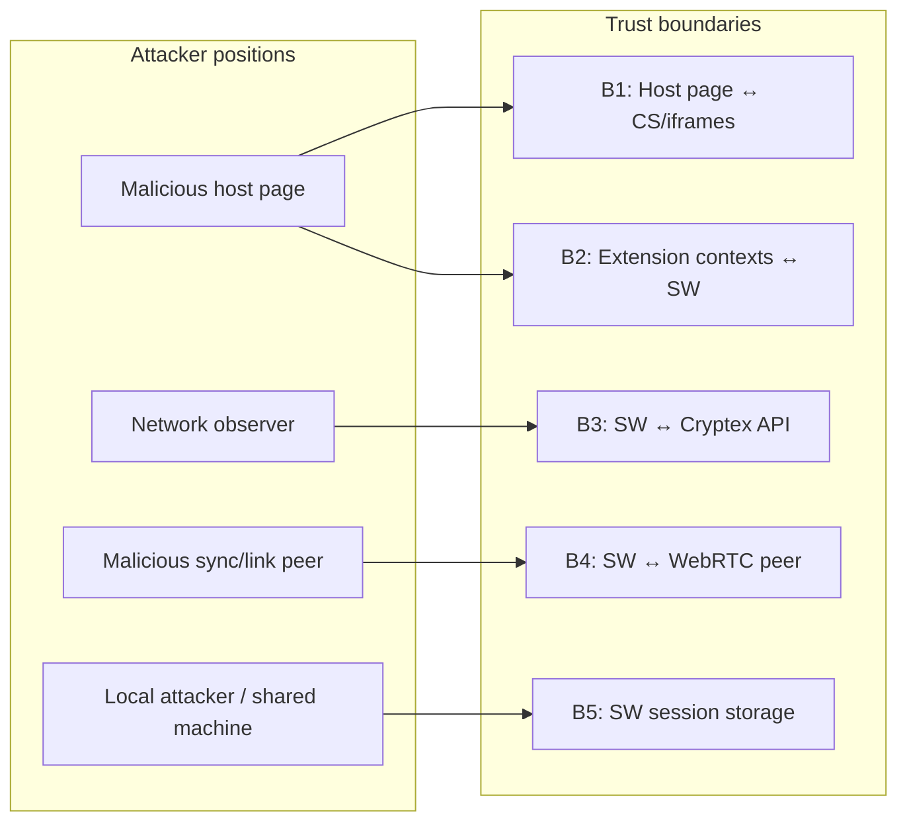
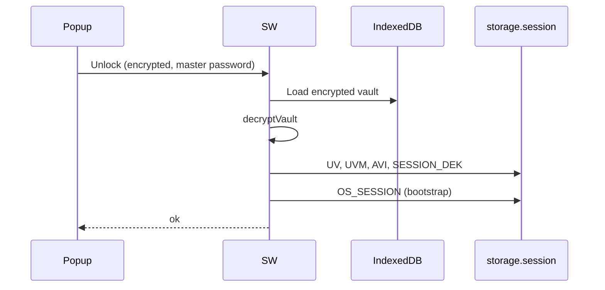
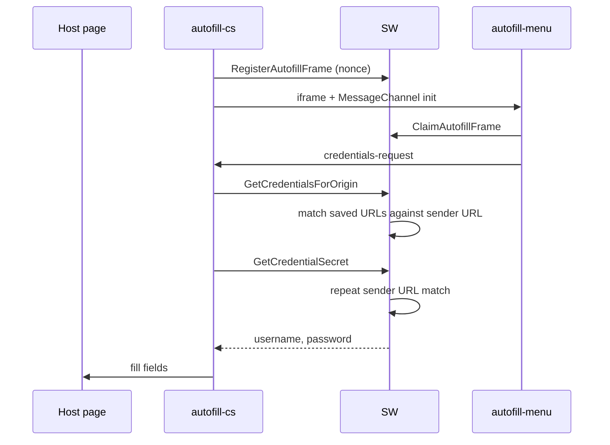
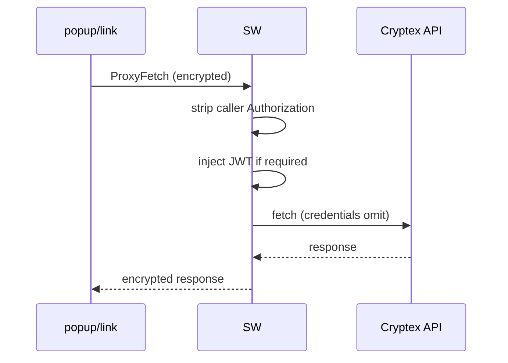
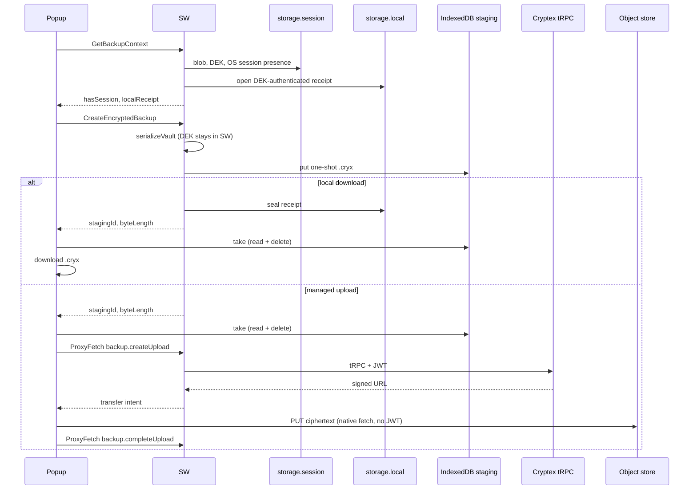

# Extension Threat Model

This document describes trust boundaries, assets, attackers, controls, and
residual risks for the Cryptex Vault browser extension. It synthesizes the
architecture docs under `extension/docs/`.

## Scope

| In scope                                                                          | Out of scope                                               |
| --------------------------------------------------------------------------------- | ---------------------------------------------------------- |
| MV3 extension (SW, popup/full-page vault, link, content script, autofill iframes) | Cryptex web app (separate codebase)                        |
| Local vault storage and session                                                   | Backend API compromise (assumed honest tRPC + TLS)         |
| Autofill on host pages                                                            | Physical device compromise (assumed out of band)           |
| Sync and link over Pusher/WebRTC                                                  | Malicious browser or OS (assumed honest Chrome)            |
| Backup Center and Vault Settings security mutations                               | Fresh-device restore and Recovery Kit flows (web app only) |

## Assets

| Asset                         | Location while at risk                                                          | Impact if exposed                                       |
| ----------------------------- | ------------------------------------------------------------------------------- | ------------------------------------------------------- |
| Master password               | Encrypted in unlock/assertion envelope; ephemeral in popup memory               | Full vault decryption                                   |
| Protection phrase/key         | Phrase in encrypted UI request; derived key in local IndexedDB                  | Completes primary-slot key derivation                   |
| Vault recovery code           | One-time encrypted response and dialog memory after rotation                    | Fallback vault decryption                               |
| Vault DEK                     | `chrome.storage.session` `SESSION_DEK:*`                                        | Decrypt vault blob at rest                              |
| Decrypted vault               | `chrome.storage.session` `UV`                                                   | All passwords, TOTP secrets, notes                      |
| Credential secrets (autofill) | CS → SW → fill path; pending save in session                                    | Per-credential exposure                                 |
| Passkey private JWK           | Encrypted vault; briefly imported non-extractable in SW                         | Authentication as that credential                       |
| Assertion ceremony            | `chrome.storage.session` for at most 2 minutes                                  | RP/challenge/candidate metadata; signing authorization  |
| Credential form draft         | `chrome.storage.session` `DRAFT_SAVE` (SW-owned)                                | Typed form data incl. new/changed password/other fields |
| Online Services JWT           | `chrome.storage.session` `OS_SESSION`                                           | API access as device                                    |
| Device signing key JWK        | `OS_SESSION`, vault `OnlineServices`                                            | Re-auth without user gesture                            |
| ECDH messaging private key    | IndexedDB `keyPairs` (non-extractable)                                          | Decrypt captured envelopes                              |
| Mnemonic (link receive)       | Link page memory during flow                                                    | Decrypt link package                                    |
| Diagnostic logs               | `chrome.storage.local` `extLogs`                                                | Metadata leakage (deviceId, vaultId, errors)            |
| Encrypted `.cryx` ciphertext  | IndexedDB `cryptex-backup-staging` (one-shot); popup after take; user Downloads | Vault at rest if the vault secret is also stolen        |
| Local backup receipt          | `chrome.storage.local` `cryptex:local-backup-receipt:{vaultId}`                 | Last-backup time and blob fingerprint; not vault bytes  |
| Clipboard                     | OS clipboard after copy actions                                                 | Credential field exposure                               |

## Trust boundaries



### B1 — Host page ↔ content script / autofill iframes

**Trust assumption:** Host page is hostile. Content script runs in isolated world
but shares the DOM.

**Controls:**

- Top-frame only (`all_frames: false`, `isTopFrame()`, `frameId === 0`)
- Iframe bootstrap nonce registered in SW; host cannot learn nonce or hijack
  MessageChannel ([autofill/iframe-bootstrap.md](autofill/iframe-bootstrap.md))
- Exact, domain, and wildcard credential release rules ([autofill/origin-matching.md](autofill/origin-matching.md))
- WebAuthn RP IDs are sender-derived or validated registrable suffixes; public
  suffixes and cross-site RP IDs are rejected
- Assertion ceremonies bind the exact origin, RP ID, challenge, vault, eligible
  authenticator IDs, tab, frame, and document; records expire, are capped, and
  are consumed after signing
- WAR limited to autofill HTML + assets (not popup/link/logs)

**Residual:** Host can DoS autofill (mount-id race, remove iframes). Host can
probe `GetState` (locked/unlocked). Host can trigger `SaveCredentialPrompt` with
arbitrary data (user must confirm in save UI). A host can invoke WebAuthn and
cause the toolbar popup to open, but the popup is extension-controlled and the
vault password never enters the host tab.

### B2 — Extension contexts ↔ service worker

**Trust assumption:** Extension pages and CS are semi-trusted; SW is root of trust.

**Controls:**

- ECDH per-request encryption with SW long-term key
- Origin URL validation per context
- Per-origin message type allowlists ([service-worker/messaging.md](service-worker/messaging.md))
- Replay protection (ULID `requestId`, ±2 min timestamp)
- Link origin restricted to proxy + OS only ([ui/README.md](ui/README.md))
- ProxyFetch strips caller `Authorization`
- Draft messages (`Get/Save/ClearCredentialDraft`) popup-allowlisted; SW shape-validates the untrusted form payload and staleness-checks edit drafts against the live vault (credential exists, not deleted, `Version` unchanged) before re-presentation
- Passkey assertion messages are content-script-only; request sizes and active
  ceremonies are bounded, exact sender/origin bindings are rechecked on completion,
  and private key material never leaves the SW
- Backup messages (`CreateEncryptedBackup`, `GetBackupContext`) are popup-only.
  The SW serializes with the session DEK and stages ciphertext in IndexedDB
  (`cryptex-backup-staging`). The envelope returns a one-shot `stagingId` and
  `byteLength`, not backup bytes. The DEK never leaves the SW.
  `CreateEncryptedBackup` rejects extra or non-boolean payload fields. Vault IDs
  used as receipt keys are bounded (`[A-Za-z0-9_-]{1,64}`). Staged blobs above
  128 MiB are refused. Debug logs redact `stagingId`. `GetBackupContext` returns
  a session-presence boolean and the opened receipt — not JWTs or vault secrets
- Vault security messages are popup-only, encrypted, shape/range validated,
  and serialized with every other vault write. Passwords and optional phrases
  reach only the SW mutation handler. The popup receives one-time display
  secrets, but never the DEK, derived protection key, or decrypted vault. DEK
  rotation rebuilds both slots, returns only a non-extractable session key from
  shared code, and reopens the committed primary slot inside the SW before
  replacing session storage
- Decrypted envelope payloads and handler results are not logged. Only message
  type and a boolean `ok` summary may reach debug output

**Residual:** Full vault in session while unlocked — any SW bug or extension
compromise is total loss. `worker` origin binding is weak (public key only).
Response envelope validation not implemented. Replay cache resets on SW eviction.
A popup that can take a staged backup receives a portable encrypted vault file;
that is intended, and unlocking it still needs the vault secret. An unused
staging row lasts until lock/idle or the next create (which clears the store).

### B3 — Service worker ↔ Cryptex API

**Trust assumption:** API is honest; TLS protects wire.

**Controls:**

- tRPC URL allowlist on configured app origin
- GET/POST only; `credentials: omit`
- JWT owned by SW; UI cannot inject auth headers
- Managed backup tRPC (`v1.backup.*`) uses `ProxyFetch` like other authenticated
  APIs. Object-store PUT/GET uses the signed URL from that tRPC response via
  native `fetch` in the popup (`credentials: "omit"`). Those URLs must **not**
  go through `ProxyFetch`, which would attach the Online Services JWT to a
  non-tRPC origin. Download checks byte length and SHA-256 against the snapshot
  metadata before the file is saved
- A security-setting commit with an Online Services binding queues an
  alarm-backed SW upload. Optional history deletion starts only after
  replacement completion. Backup bytes are captured as one
  coordinator-exclusive snapshot, while network work happens after the queue
  is released. The job binds that snapshot to its vault ID and Online Services
  device ID; every authenticated request rechecks the device identity. Backup
  jobs are serialized separately so concurrent purge requests cannot delete
  each other's replacements. Their status is separate from the local mutation,
  so network/delete errors cannot roll back the vault

**Residual:** Compromised API or DNS hijack on dev wildcard host permissions.
Mitigated in production by narrowed `host_permissions`. Object-store PUT/GET
from the popup is a CORS request from `chrome-extension://<id>`, not a
`host_permissions` fetch. It works when the bucket already allows that origin
(or `*`) — the same CORS the web vault uses for signed URLs. Adding the object
store to production `host_permissions` would bypass CORS and widen the install
warning; do not add it unless CORS cannot include the extension origin. A
browser shutdown can interrupt an alarm-backed upload or purge. The safe
failure mode retains older restore points; the user must retry after unlock.

### B4 — Extension ↔ sync/link peer (Pusher + WebRTC)

**Trust assumption:** Signaling infrastructure may be observed; peer may be malicious.

**Controls:**

- Pusher channel auth via proxied tRPC + JWT
- PQ KEM + signing handshake on sync sessions
- AEAD on sync and link vault transfer payloads
- Link package encrypted with mnemonic (never on wire)

**Residual:** Signaling MITM can disrupt or metadata-probe sessions; app-layer
crypto mitigates payload disclosure but does not remove signaling trust.
`SyncUpdateCredentials` merges inbound credentials without deep schema validation.

### B5 — Session and local persistence

**Trust assumption:** Browser session storage is confidential within the browser profile.

**Controls:**

- Lock + idle clear all session keys
- DEK `TRUSTED_CONTEXTS` access level
- Vault encrypted at rest in IndexedDB
- Generated-phrase keys persist device-locally across lock so the
  normal profile needs only the master password. They are never synced; a
  restore or cleared profile needs the saved phrase
- Credential form draft (`DRAFT_SAVE`) session-scoped: cleared on lock, idle lock, browser shutdown, successful save, and explicit user discard
- Local backup receipts are DEK-authenticated AES-GCM with vault-id AAD, size-bounded
  (`<=512` stored chars), and treated as hostile on read. Lock does not delete them;
  without the DEK they are indistinguishable from corrupt or forged input

**Residual:** Unlocked vault is plaintext in `chrome.storage.session`. Malware with
browser profile access reads `UV`. Pending save holds password up to 5 minutes.
Form drafts hold typed (possibly new/changed) passwords for the whole unlocked
window (up to 30 min idle).
Logs persist device/vault metadata to `chrome.storage.local`. Receipts persist
across lock and restart; they do not contain vault plaintext. A local `.cryx`
download lives in the user's Downloads folder — encrypted, user-held, and not
proven to still exist by the receipt.

Old downloaded or retained backups are independent encrypted artifacts. A
password, recovery-code, or DEK change to the current vault cannot revoke a
file already in Downloads; that file may still open with its previous
credentials. Managed history deletion is an explicit account-wide operation,
including older linked-device snapshots, because the API exposes no stable
device/vault filter. It reduces hosted exposure but cannot make copies held
elsewhere disappear.

## Attacker models

### A1 — Malicious website (top frame, user has extension installed)

**Goals:** Steal credentials, probe vault state, inject saved logins, disrupt autofill.

| Technique                                    | Control                                        | Residual risk                                                   |
| -------------------------------------------- | ---------------------------------------------- | --------------------------------------------------------------- |
| Request secrets outside configured URL rules | Shared URL rule matcher                        | Low - blocked                                                   |
| Abuse a broad domain or wildcard rule        | Explicit per-rule mode                         | **Medium** - user-approved scope may include a compromised host |
| Request secrets for an authorized phish host | Sender-derived URL recheck                     | **Medium** - works when a saved rule authorizes that host       |
| Probe vault locked/unlocked                  | `GetState` from CS                             | Low - metadata only                                             |
| Hijack iframe MessageChannel                 | SW nonce bootstrap                             | Low - blocked                                                   |
| Stash fake login for save prompt             | `SaveCredentialPrompt`                         | Low - user must confirm                                         |
| Read extension bundle via WAR                | WAR exposes assets                             | Low - fingerprinting, no secrets                                |
| Request assertions for another RP            | RP/origin + PSL validation                     | Low - blocked                                                   |
| Reuse or swap an eligible passkey            | Bound one-shot ceremony                        | Low - exact authenticator ID is rechecked                       |
| Flood assertion ceremonies                   | Per-document serialization, TTL and global cap | Low - bounded availability impact                               |
| Spoof password confirmation visually         | Password is accepted only in the toolbar popup | Low - a page lookalike cannot complete the ceremony             |

### A2 — Malicious website (subframe)

**Goals:** Same as A1 from embedded iframe.

| Technique           | Control                             | Residual risk |
| ------------------- | ----------------------------------- | ------------- |
| Pose as autofill-cs | `frameId === 0` + top-frame CS gate | Low — blocked |

### A3 — Network attacker

**Goals:** Intercept API traffic, replay envelopes, MITM sync signaling.

| Technique                            | Control                               | Residual risk                        |
| ------------------------------------ | ------------------------------------- | ------------------------------------ |
| Replay SW envelopes                  | Nonce cache + timestamp               | Low–medium — cache resets on SW wake |
| Forge API requests from extension UI | ProxyFetch allowlist + JWT in SW      | Low                                  |
| Attach JWT to object-store transfer  | Native fetch; ProxyFetch is tRPC-only | Low - signed URL is capability       |
| Read sync/link payloads on wire      | AEAD session encryption               | Low                                  |
| MITM signaling                       | Channel auth + handshake signatures   | Medium — availability/metadata       |

### A4 — Malicious sync or link peer

**Goals:** Inject credentials, exfiltrate vault during sync/link.

| Technique                     | Control                           | Residual risk                                             |
| ----------------------------- | --------------------------------- | --------------------------------------------------------- |
| Send crafted sync credentials | Encrypted session + SW merge      | Medium — merge trusts peer ciphertext after crypto verify |
| Impersonate link sender       | Link package needs mnemonic + MAC | Low — mnemonic out of band                                |

### A5 — Local attacker / shared machine

**Goals:** Read vault from disk, logs, clipboard, or unlocked session.

| Technique                      | Control                     | Residual risk                                                    |
| ------------------------------ | --------------------------- | ---------------------------------------------------------------- |
| Read IndexedDB vault blobs     | Encrypted at rest           | Low without master password                                      |
| Read session while unlocked    | Lock on idle                | **High** - `UV` is plaintext                                     |
| Read form draft while unlocked | Session-scoped `DRAFT_SAVE` | Medium - typed password until lock/idle/discard                  |
| Read persisted diagnostic logs | Browser profile access      | Medium - metadata                                                |
| Read local backup receipts     | DEK-authenticated AES-GCM   | Low without DEK; Medium while unlocked (time + fingerprint only) |
| Read downloaded `.cryx`        | Encrypted vault file        | Low without vault secret; user-held like any backup              |
| Read clipboard after copy      | OS clipboard                | Medium - expected PM behavior                                    |

### A6 — Extension supply chain / developer mistake

**Goals:** N/A — integrity failure.

| Technique                             | Control                                   | Residual risk                                        |
| ------------------------------------- | ----------------------------------------- | ---------------------------------------------------- |
| Dev wildcard host_permissions shipped | Prod manifest rewrite                     | Low if checklist followed                            |
| Debug logging of decrypted payloads   | SW logs message type/boolean outcome only | Low; contributor rule still required                 |
| Incomplete VaultOperations            | Missing KEM/signing key getters           | **Mitigated** — full bridge in `vault-operations.ts` |

## Controls matrix

| Control                             | Protects against                          | Location                                        |
| ----------------------------------- | ----------------------------------------- | ----------------------------------------------- |
| ECDH envelope encryption            | Eavesdropping on extension message bus    | `session-utils.ts`                              |
| Origin + capability ACL             | Unauthorized SW operations                | `security-utils.ts`, `background.ts`            |
| Top-frame CS gate                   | Subframe autofill attacks                 | `autofill-cs.ts`, `security-utils.ts`           |
| Iframe nonce bootstrap              | Host hijack of MessageChannel             | `autofill-frame-bootstrap.ts`                   |
| RP-bound assertion ceremony         | Cross-origin/replay/passkey substitution  | `passkey-assertion-service.ts`                  |
| Vault-password assertion UV         | Signing without requested verification    | `session-dek-store.ts`                          |
| Per-rule autofill release           | Credential theft outside saved URL rules  | `credential-url.ts`, `autofill-router.ts`       |
| SW-owned JWT                        | UI token injection                        | `request-auth-interceptor.ts`                   |
| tRPC allowlist                      | Arbitrary fetch from proxy                | `trpc-auth-url.ts`                              |
| Lock + idle session clear           | Stale session exposure                    | `background.ts`                                 |
| Draft shape + staleness validation  | Untrusted or stale form data re-presented | `credential-draft-store.ts`, `vault-view.tsx`   |
| Link ACL restriction                | Link page vault unlock/CRUD               | `background.ts` allowlist                       |
| AEAD sync/link wire                 | Network peer payload disclosure           | `synchronization.ts`, `linking.ts`              |
| Argon2id vault sealing              | Offline vault blob cracking               | shared vault utils                              |
| Popup-only backup messages          | CS/link cannot mint `.cryx` or receipts   | `background.ts`, `backup-service.ts`            |
| IndexedDB backup staging            | Ciphertext not copied through envelopes   | `backup-staging.ts`                             |
| DEK-sealed local backup receipts    | Forged coverage / cross-vault receipt use | `backup-status.ts`, `backup-service.ts`         |
| Signed-URL fetch off ProxyFetch     | JWT sent to object-store origin           | `managed-backups.ts`                            |
| Queued SW security mutations        | Key/state races and popup key exposure    | `background.ts`, `vault-security-service.ts`    |
| Persist-then-session DEK reopen     | Publishing an uncommitted rotated key     | `storage.ts`, `session-dek-store.ts`            |
| Replacement-before-delete backup    | Losing all managed recovery points        | `security-backup-job.ts`                        |
| Account- and vault-bound backup job | Cross-vault upload or history deletion    | `security-backup-job.ts`, `auth-session-ext.ts` |

## Residual risks (prioritized)

| Priority | Risk                                                | Mitigation status | Notes                                                                                              |
| -------- | --------------------------------------------------- | ----------------- | -------------------------------------------------------------------------------------------------- |
| P0       | Plaintext vault in session while unlocked           | Accepted design   | Central assumption; lock reduces window                                                            |
| P1       | Broad domain or wildcard autofill rule              | Partial           | Explicit mode, UI warning, safe wildcard validation                                                |
| P1       | In-page vault-password prompt is visually spoofable | Fixed             | Confirmation now lives in the toolbar popup                                                        |
| P1       | Extension sync `VaultOperations` incomplete         | Fixed             | Full bridge + cached `SyncGetConfiguration`                                                        |
| P2       | `window.open` without `noopener` on credential URLs | Fixed             | `noopener,noreferrer` on credential URL opens                                                      |
| P2       | Pending save password in session (5 min)            | Accepted          | Bounded TTL; user confirmation required                                                            |
| P2       | Draft password in session (unlocked window)         | Accepted          | Session-scoped; explicit discard confirmation; shape-validated at SW boundary                      |
| P2       | OS device private key in session                    | Accepted          | Enables refresh; cleared on lock                                                                   |
| P2       | Web/SW auth-session split for signaling/TURN        | Fixed             | `onlineServicesSessionPort` + tRPC/SW proxy                                                        |
| P3       | Response envelope validation stub                   | Open              | Same-extension channel limits impact                                                               |
| P3       | Replay cache lost on SW eviction                    | Accepted          | Short window                                                                                       |
| P3       | Logs persist metadata locally                       | Accepted          | Cleared with extension local data                                                                  |
| P3       | Local backup receipts persist after lock            | Accepted          | DEK-authenticated; opaque without session DEK                                                      |
| P3       | Downloaded `.cryx` on disk                          | Accepted          | Encrypted; receipt cannot prove the file still exists                                              |
| P3       | Object-store CORS vs extension origin               | Accepted          | Signed URL fetch uses CORS, not `host_permissions`; bucket must allow `chrome-extension://` or `*` |
| P3       | WAR exposes bundle hashes                           | Accepted          | Fingerprinting only                                                                                |
| P3       | `SyncUpdateCredentials` trusts peer after crypto    | Partial           | Crypto verifies channel, not semantic content                                                      |
| P4       | `worker` origin weak binding                        | Accepted          | Public key only                                                                                    |
| P4       | Extension WebAuthn PRF unsupported                  | Accepted          | Protection phrases supported; PRF changes remain web-app-only                                      |

## Data flow diagrams

### Unlock



### Autofill secret release



### Vault security / optional DEK rotation

```mermaid
sequenceDiagram
    participant Popup
    participant SW
    participant IDB as IndexedDB
    participant Session as storage.session
    participant Backup as Managed backup job

    Popup->>SW: Reconfigure/rotate (encrypted current credentials + choices)
    SW->>SW: enter single-writer queue; unwrap current DEK
    alt rewrap only (default)
        SW->>SW: rebuild requested key slot(s)
    else rotate local DEK
        SW->>SW: fresh DEK + IV; re-encrypt; rebuild both slots
    end
    SW->>IDB: persist complete candidate metadata
    IDB-->>SW: committed
    SW->>SW: reopen committed primary slot
    SW->>Session: replace metadata and rotated DEK bytes
    SW-->>Popup: display secrets + status (encrypted; no DEK)
    SW->>Backup: queue independent replacement upload
    opt delete older managed history
        Backup->>Backup: delete only after replacement completes
    end
```

### Passkey assertion

```mermaid
sequenceDiagram
    participant Page as Host page
    participant CS as isolated content script
    participant UI as toolbar popup
    participant SW as service worker

    Page->>CS: navigator.credentials.get options
    CS->>SW: Begin assertion (encrypted)
    SW->>SW: validate RP/origin, filter passkeys, bind capped 2-minute ceremony
    SW->>UI: eligible candidates (encrypted)
    UI->>SW: selected vault item + vault password (encrypted)
    SW->>SW: recheck sender/origin/vault/exact credential; verify password
    SW->>SW: sign authenticatorData + clientData hash; consume ceremony
    CS->>SW: poll bound ceremony
    SW-->>CS: public assertion only
    CS-->>Page: PublicKeyCredential assertion
```

### tRPC proxy



### Backup Center



## Hardening roadmap

Ordered by threat-model priority:

1. Implement response envelope validation (`TODOvalidateResponseEnvelope`).
2. Broadcast `KEY_ROTATED` on ECDH rotation.
3. Schema validation on `SyncUpdateCredentials` inbound credentials.
4. Document contributor policy: never log credential fields to `extLogs`.

## Related documentation

- [Architecture overview](architecture/overview.md)
- [Service worker messaging](service-worker/messaging.md)
- [Session and keys](service-worker/session-and-keys.md)
- [UI surfaces](ui/README.md)
- [Sync and link](sync-and-link/README.md)
- [Online Services](sync-and-link/online-services.md)
- [Platform layer](platform/README.md)
- [Autofill security](autofill/README.md)
