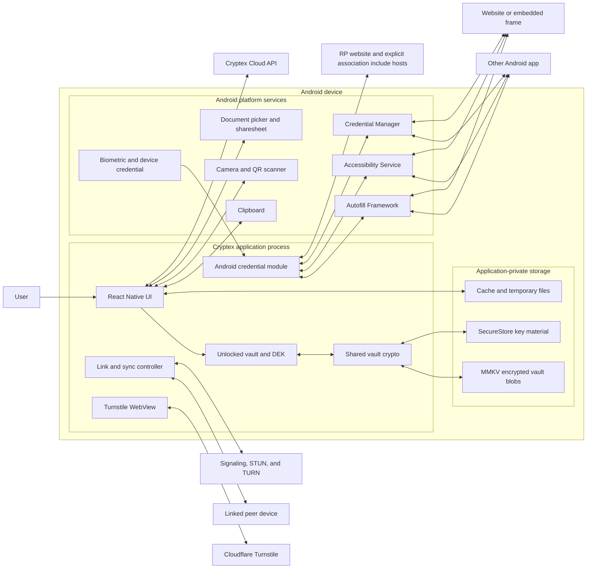

# Cryptex Vault mobile application threat model

## Document control

| Field               | Value                                                                                |
| ------------------- | ------------------------------------------------------------------------------------ |
| Application         | Cryptex Vault mobile application                                                     |
| Application version | 0.1.0                                                                                |
| Platform in scope   | Android                                                                              |
| Document version    | 1.0                                                                                  |
| Status              | Active engineering threat model                                                      |
| Last reviewed       | 2026-10-01                                                                           |
| Document owner      | Mobile engineering                                                                   |
| Source baseline     | `13ed0e7de76c542bf07a7c7a0d31d60a06926e5f`, published to `origin/development` on 2026-10-07 |
| Security reviewer   | Milivoj Bošnjak (8l4cksmith), 2026-10-07                                              |
| Review cadence      | Before each production release and whenever a review trigger in section 18 occurs    |

## 1. Purpose

This model covers the Android app and the shared code it bundles. It records trust boundaries, security controls, open risks, and release checks.

Cryptex Vault is a local-first password manager. The central security boundary is the vault lock state:

- A locked vault should leave only encrypted vault data in ordinary application storage. Unlock keys and vault plaintext should be unavailable to application code.
- An unlocked vault necessarily holds plaintext and a data encryption key in process memory. The application must limit their lifetime and release secrets only to a destination the user intended.
- Local-first means core vault use does not require Cryptex Cloud. Online Services are enabled by default in production builds; account use remains optional. Backup, passkey association checks, signaling, TURN and bot protection can create network traffic. Source builders can explicitly disable Online Services.

This is a living design document, not a security certification or an OWASP MASVS compliance claim.

## 2. Method

Threats use STRIDE categories: spoofing `S`, tampering `T`, repudiation `R`,
information disclosure `I`, denial of service `D`, and elevation of privilege `E`.
Controls are grouped by OWASP MASVS family; the labels do not claim compliance.

### 2.1 Risk rating

Likelihood and impact use a five-point scale. The risk score is `likelihood × impact`.

| Value | Likelihood                                                    | Impact                                                                           |
| ----- | ------------------------------------------------------------- | -------------------------------------------------------------------------------- |
| 1     | Rare: requires exceptional access or conditions               | Negligible: no secret disclosure and little operational effect                   |
| 2     | Unlikely: practical only in an uncommon configuration         | Minor: limited metadata exposure or recoverable degradation                      |
| 3     | Possible: a capable attacker can meet the prerequisites       | Moderate: local data exposure, persistent failure, or material denial of service |
| 4     | Likely: common attacker-controlled input reaches the weakness | Major: credential or vault-integrity loss affecting a user                       |
| 5     | Almost certain: expected during ordinary hostile interaction  | Severe: broad or durable compromise of vault confidentiality or integrity        |

| Score | Rating   |
| ----- | -------- |
| 1-4   | Low      |
| 5-9   | Medium   |
| 10-16 | High     |
| 17-25 | Critical |

Ratings describe residual risk in the reviewed implementation. They are engineering priorities, not CVSS scores.

Risk responses use four terms:

- **Mitigate:** implement controls that lower likelihood or impact.
- **Eliminate:** remove the feature or data flow that creates the risk.
- **Transfer:** move responsibility through a clear external contract.
- **Accept:** a named owner records why the residual risk is tolerable and when to review it.

## 3. Scope

### 3.1 In scope

- Expo and React Native application code in `mobile/app` and `mobile/src`.
- Android native code, manifests, resources, and Expo modules under `mobile/modules`, `mobile/android`, and `mobile/plugins`.
- Android Autofill Service, the optional accessibility fallback, and Android 14 or newer Credential Manager provider.
- Shared code that is bundled into or directly controls the mobile application, especially `packages/vault-core`, the API contract, and shared QR helpers.
- Vault creation, unlock, recovery, reconfiguration, save, lock, biometric unlock, and local storage.
- Credentials, passkeys, TOTP seeds, notes, device records, connectivity secrets, and security-analysis data.
- Import, restore, export, recovery kits, clipboard, camera and QR input, file sharing, diagnostics, and temporary files.
- Device linking, encrypted peer synchronization, signaling, STUN, and TURN configuration.
- Optional Online Services sessions, managed backups, account recovery, and the Turnstile WebView.
- Android build, signing, dependencies, permissions, backup rules, and publication checks.

### 3.2 Out of scope

- iOS behavior and iOS-native components.
- Cryptex Cloud server implementation, server-side authorization, billing, retention, and operational security.
- Internal security of Pusher, Cloudflare, relying-party association hosts, custom signaling servers, STUN servers, TURN servers, app stores, or the Android operating system.
- Security of a rooted or otherwise compromised operating system.
- Confidentiality after an attacker gains code execution inside the unlocked application process.
- Social recovery, customer-support procedures, and organizational access controls outside this repository.
- Android behavior not exercised by the recorded emulator runs or a physical-device test.

Out-of-scope components remain trust dependencies. Their compromise can still affect the application.

## 4. Security objectives

The application has the following security objectives, in priority order:

1. **Locked-vault confidentiality.** Possession of application storage must not reveal vault plaintext without valid unlock material.
2. **Correct secret release.** Autofill, passkey, clipboard, export, and sharing flows must release only the secret the user selected to the intended destination.
3. **Vault integrity.** Unauthorized parties must not insert, replace, roll back, or corrupt vault contents without detection.
4. **Session revocation.** Locking and timeout events must revoke every path that can read or release secrets, even when saving or cleanup fails.
5. **Peer authenticity.** Device linking and synchronization must authenticate the peer and bind each message to the active ceremony or session.
6. **Bounded processing.** Untrusted files, QR frames, KDF parameters, network messages, and native inputs must have enforceable resource limits.
7. **Recovery.** Users must be able to recover from lost devices and compromised unlock material without creating false revocation expectations.
8. **Privacy.** The application should disclose and minimize metadata sent to Cryptex and third parties.
9. **Release integrity.** Published packages must come from the intended source, configuration, signing identity, and dependency set.

## 5. System model

### 5.1 Components and data-flow diagram

### 5.2 Runtime states

| State      | Secret availability                                                 | Permitted behavior                                                         | Security condition                                                                      |
| ---------- | ------------------------------------------------------------------- | -------------------------------------------------------------------------- | --------------------------------------------------------------------------------------- |
| No vault   | No vault secrets                                                    | Create, restore, or receive a first vault                                  | Imported and link inputs remain untrusted until authenticated and parsed within limits  |
| Locked     | Encrypted vault blob; optional device-bound material in SecureStore | Show vault metadata, unlock, restore, or receive permitted system requests | No vault plaintext, DEK, cloud bearer token, or active sync secret should remain usable |
| Unlocking  | Password, recovery code, or biometric operation in progress         | Derive or unwrap keys and authenticate ciphertext                          | Untrusted KDF costs must be bounded before expensive work                               |
| Unlocked   | Vault plaintext and DEK in memory                                   | Read, edit, save, sync, fill, copy, export, and use passkeys               | Every secret-release path must check the current session and intended target            |
| Locking    | Save and cleanup in progress                                        | Opaque UI only                                                             | Secret-release capabilities must be revoked even if persistence fails                   |
| Background | Process may be suspended with memory retained                       | No user-driven operation                                                   | Timeout policy must remain enforceable despite JavaScript suspension                    |

## 6. Assets and data classification

| Asset                                            | Classification                  | Location and lifetime                                   | Required protection                                                  |
| ------------------------------------------------ | ------------------------------- | ------------------------------------------------------- | -------------------------------------------------------------------- |
| Master password                                  | Restricted                      | User input during create, unlock, and reauthentication  | Never persist or log; minimize copies and lifetime                   |
| Recovery code                                    | Restricted                      | User input and recovery-kit output                      | Treat as an alternate vault-unlock secret                            |
| Device additional key protection material        | Restricted                      | SecureStore, device-only accessibility                  | Never sync or expose through diagnostics                             |
| Data encryption key, DEK                         | Restricted                      | Memory while unlocked; optional biometric-wrapped form  | Clear on lock and session expiry; prevent ordinary export            |
| Vault plaintext                                  | Restricted                      | React Native memory while unlocked                      | Never persist outside encrypted vault or explicit user export        |
| Encrypted vault envelope and ciphertext          | Confidential                    | MMKV, backup files, managed backup                      | Authenticate, resist offline guessing, validate format and KDF costs |
| Credentials and TOTP seeds                       | Restricted                      | Encrypted vault and unlocked memory                     | Release only with user intent and verified destination context       |
| Passkey private keys                             | Restricted                      | Encrypted vault and transient crypto operation          | RP and caller checks, current session, fresh user verification       |
| Device-link mnemonic and package                 | Restricted                      | UI, QR, link file, and memory during ceremony           | Authenticate the complete ceremony and expire it                     |
| Sync signing and KEM private keys                | Restricted                      | Encrypted vault                                         | Authenticate sessions and messages; never log                        |
| Online Services device private key               | Restricted                      | Encrypted vault                                         | Use only for bounded authentication challenges                       |
| Online Services access and refresh tokens        | Restricted                      | Process memory                                          | Bind to session generation; clear on lock and sign-out               |
| Custom TURN and signaling credentials            | Restricted                      | Encrypted vault and connection setup                    | Mask in UI and diagnostics; transmit only to configured services     |
| Autofill request metadata                        | Confidential                    | Native memory and credential UI for a short request     | Authenticate request provenance and target; enforce expiry           |
| Browser and app identity                         | Security-sensitive metadata     | Android package, accessibility tree, Autofill structure | Do not treat attacker-controlled labels as authoritative identity    |
| Import and export files                          | Restricted or untrusted         | Document provider, app cache, sharesheet recipient      | Bound parsing; delete app copies; warn before plaintext export       |
| Clipboard contents                               | Restricted when copying secrets | System clipboard                                        | Mark sensitive, clear conditionally, disclose OS ownership           |
| Vault name, account, device, and domain metadata | Confidential                    | Storage, logs, network requests, provider UI            | Minimize disclosure and redact production diagnostics                |
| Turnstile token                                  | Confidential, ephemeral         | WebView to one API request                              | Validate origin and nonce; do not persist or log                     |
| Private release signing key and passwords        | Restricted                      | Private directory outside the checkout; signing process | Never enter source or APK; keep an encrypted offline backup          |
| Public release configuration and certificate     | Public, integrity-sensitive      | Checked-in JSON; public configuration and APK signature  | Review changes; require the approved configuration and signer        |

## 7. Trust zones and boundaries

| ID    | Boundary                                            | Data crossing                                                     | Existing controls                                                                                                        | Residual concern                                                                                  |
| ----- | --------------------------------------------------- | ----------------------------------------------------------------- | ------------------------------------------------------------------------------------------------------------------------ | ------------------------------------------------------------------------------------------------- |
| TB-01 | Unlocked process to local storage                   | Encrypted vault, metadata, device-bound keys                      | Authenticated encryption, MMKV app sandbox, SecureStore, enforced session deadline                                       | Save failure can delay memory cleanup; encrypted data remains subject to offline guessing        |
| TB-02 | JavaScript to native Android module                 | Credential requests, secrets selected for fill, passkey material  | Typed wrappers, private native request registry, random handles, freshness checks, protected service bindings           | A killed process cancels its pending request; valid request results depend on the live relay       |
| TB-03 | Cryptex to another app                              | Username, password, TOTP, saved app association                   | Protected callbacks, private request registry, explicit selection, exact package association                             | Saved app associations identify the package, not its publisher certificate                         |
| TB-04 | Cryptex to a browser or web content                 | Website credentials and passkeys                                  | URI matching, framework domains, explicit browser/resource-ID policy, user selection                                      | Package names do not prove publisher identity; top-level URL does not prove field or iframe origin |
| TB-05 | Application to Android OS services                  | Biometrics, clipboard, camera, picker, sharing, screenshots       | Platform APIs, least requested permissions, sensitive clipboard flag                                                     | OS owns data after release; timers can pause; behavior varies by Android version and device        |
| TB-06 | Application to peer device                          | Link package, vault transfer, sync messages                       | Pairing phrase, sender-signed transfer context, KEM, AEAD, signed sync, sequence checks                                  | Peer compromise and traffic-analysis or availability attacks remain out of scope                  |
| TB-07 | Application to signaling, STUN, and TURN            | Connection metadata and optional credentials                      | Payload encryption, user-selected endpoints, HTTPS policy where applicable                                               | Services observe connection metadata and can block or redirect traffic                            |
| TB-08 | Application to Cryptex Cloud                        | Account data, device auth, backups, recovery and billing metadata | Default-on services, optional account use, signed challenge, session generation checks, TLS                              | Server behavior is out of scope; service sees required metadata and encrypted backup objects      |
| TB-09 | Turnstile WebView to hosted page                    | Action, nonce, token, error status                                | HTTPS in production, origin/path/action allowlists, schema validation                                                    | WebView and hosted route remain external parsing and navigation surfaces                          |
| TB-10 | Credential provider to RP association hosts         | Website statement request, device IP, and timing                   | Direct HTTPS, exact local package/certificate/relation checks, bounded includes and responses, no redirects               | Native-app checks need connectivity; website and delegated hosts see request metadata             |
| TB-11 | Untrusted file or QR to parsers                     | Vault, import, credential, TOTP, and device-link data             | A 1 GB outer-file limit before JavaScript materialization, format checks, and cryptographic authentication where defined | Expanded-size, nesting, QR, and wire-message limits remain incomplete                             |
| TB-12 | Source and dependencies to release APK              | Code, native libraries, flags, signing identity                   | Frozen lock, Maven checksums, pinned toolchain/actions, isolated production build, final APK policy and signer checks    | Publication still needs an identified source baseline, protected key backup and F-Droid recipe review |

## 8. Entry points

| ID    | Entry point                                                             | Trust level                                    | Primary concerns                                                            |
| ----- | ----------------------------------------------------------------------- | ---------------------------------------------- | --------------------------------------------------------------------------- |
| EP-01 | Master password, protection phrase, recovery code, and biometric unlock | User-controlled but secret                     | Brute force, KDF denial of service, shoulder surfing, stale key access      |
| EP-02 | Android launcher and `cryptex:` deep links                              | Untrusted external caller                      | Intent spoofing and unsafe routing                                           |
| EP-03 | Autofill Service callbacks                                              | Android-mediated                               | Destination identity, stale requests, secret release                        |
| EP-04 | Accessibility event and node tree                                       | App-controlled content exposed through Android | Browser spoofing, misleading labels, wrong field selection                  |
| EP-05 | Credential Manager create/get requests                                  | Android-mediated caller data                   | RP confusion, caller verification, replay, stale ceremony                   |
| EP-06 | Document picker and restore/import files                                | User-selected untrusted bytes                  | Parser bugs, decompression bombs, KDF exhaustion, plaintext cache retention |
| EP-07 | Camera and QR scanner                                                   | Attacker-presented untrusted text              | Oversized multipart data, malformed payload, link substitution              |
| EP-08 | Clipboard                                                               | Shared OS resource                             | Disclosure, stale secret, malicious replacement                             |
| EP-09 | Sharesheet and exported file recipients                                 | User-selected external destination             | Permanent plaintext disclosure, abandoned cache copies                      |
| EP-10 | Signaling and WebRTC data channels                                      | Network and peer-controlled                    | Link substitution, replay, malformed or oversized messages                  |
| EP-11 | Cryptex Cloud API and managed backup responses                          | External service                               | Authorization failure, rollback, malicious lengths and metadata             |
| EP-12 | Turnstile WebView navigation and messages                               | Hosted web content                             | Origin confusion, injected bridge messages, token leakage                   |
| EP-13 | Environment variables and build configuration                           | Build operator-controlled                      | Wrong endpoints, E2E flags, debug signing, supply-chain compromise          |
| EP-14 | Dependency installation and native build inputs                         | Registry and upstream-controlled               | Malicious package, stale native library, mutable CI dependency              |

## 9. Threat actors

| Actor                                   | Capability                                                                                                            | Excluded capability                                                                   |
| --------------------------------------- | --------------------------------------------------------------------------------------------------------------------- | ------------------------------------------------------------------------------------- |
| Opportunistic device thief              | Obtains a locked device, app storage, backup, or exported file                                                        | Does not know the master password or control the unlocked process                     |
| Malicious installed app                 | Sends intents, handles HTTPS links, exposes crafted accessibility nodes, reads shared OS resources allowed by Android | Cannot bypass Android sandbox or protected binding permissions                        |
| Malicious website or frame              | Controls HTML fields, frames, URLs, navigation, and submitted values                                                  | Does not compromise an authentic browser process                                      |
| Network attacker                        | Observes, blocks, delays, replays, or redirects traffic where transport and name validation allow                     | Cannot break correctly implemented TLS or modern cryptography                         |
| Malicious or compromised peer           | Participates in link or sync protocols and sends arbitrary messages                                                   | Does not already possess every current vault key unless stated                        |
| Malicious file or QR author             | Supplies arbitrary import, backup, recovery, TOTP, or link data                                                       | Does not bypass required user selection by default                                    |
| Compromised external service            | Controls responses and observes metadata for its service                                                              | Does not automatically decrypt client-encrypted vault data                            |
| Supply-chain attacker                   | Publishes or replaces a package, native source archive, CI action, or build input                                     | Does not possess the intended production signing key unless stated                    |
| Curious support or diagnostic recipient | Receives user-exported logs or metadata                                                                               | Does not have app-process memory or the user's vault password                         |
| Compromised unlocked device             | Reads process memory, UI, keystrokes, or platform data                                                                | None relevant to unlocked confidentiality; this actor is outside the protection claim |

## 10. Assumptions and dependencies

The security claims in this model depend on these assumptions:

- Android app sandboxing, Android Keystore, SecureStore, biometric APIs, Autofill, Credential Manager, WebView origin reporting, and TLS validation behave as documented.
- React Native Quick Crypto, OpenSSL, libsodium-compatible code, Noble post-quantum code, and random-number generation are correctly implemented in the shipped native artifact.
- The user installs an authentic Cryptex APK and protects the device with an appropriate screen lock.
- The master password and recovery code have enough entropy and remain private.
- Build operators protect signing keys, environment variables, and release credentials.
- Configured API, app, signaling, STUN, and TURN endpoints are the user's intended services.
- Cloud authorization and backup isolation work as required by their external contracts. This repository cannot prove those server properties.
- The application cannot guarantee secrecy after OS compromise or arbitrary code execution in the unlocked process.
- JavaScript and garbage-collected native bridges cannot promise complete memory zeroization. The design can reduce copies and lifetimes.
- Screenshot blocking, clipboard clearing, biometric invalidation, autofill field identity, iframe handling, and Keystore enforcement can vary by Android version and device. Emulator results do not establish physical-device behavior.

## 11. Existing control catalog

### 11.1 MASVS-STORAGE

- The application stores encrypted vault envelope bytes in app-private MMKV storage.
- SecureStore holds device-bound additional key protection material and per-vault biometric wrapping keys with device-only accessibility settings.
- An entered protection phrase reaches SecureStore only after it successfully opens the authenticated envelope. Owned mutable derivation buffers are wiped after use.
- The DEK normally remains in module memory only while the vault is unlocked. Each local vault's biometric enrollment stores its wrapped DEK and device-bound wrapping key in a separate SecureStore keychain service.
- Android OS backup is disabled. Reviewed resources exclude every app-data domain from cloud backup and device-to-device transfer, including SecureStore. Explicit vault exports and managed backups remain available.
- Secret clipboard writes use Android's sensitive-clipboard path when the native module is available. A native ownership marker limits clearing to the app's current clip; a 30-second native timer, resume check, and lock cleanup attempt to clear it. Android may defer a frozen process, and recipient apps may already have copied it.
- App-created share files use a dedicated secret-temporary cache directory. Picker copies are removed after reading, and import/export and recovery-kit flows clean up app-owned files on completion or abandonment. Startup and lock purge the app-owned secret-temporary and picker cache directories; a killed process can leave cache files until the next launch.

### 11.2 MASVS-CRYPTO

- Current vault envelopes use AES-256-GCM for vault data, AES key wrapping for the DEK, Argon2id for password processing, and HKDF for key separation.
- Encryption uses random nonces or IVs as required by each construction and authenticates encrypted content.
- Mobile creation defaults to 128 MiB and three Argon2id passes. Existing vaults can carry other parameters.
- Recovery and primary unlock slots normally rewrap the same DEK. The security flow can instead rotate the DEK for the current vault copy when compromise recovery requires it.
- Ordinary peer synchronization uses post-quantum KEM and signing keys, authenticated encryption, sequence checks, and version-aware merges.
- Android uses source-built OpenSSL 3.5.8 and a pinned M150 WebRTC provider. The native audit records source/build references, checksums and notices; final APK checks cover the reviewed native libraries across all four ABIs. This is not a complete transitive SBOM or a vulnerability-free claim.

### 11.3 MASVS-AUTH

- Password unlock authenticates the encrypted vault. Optional device-local additional key protection and recovery unlock are separate paths.
- Biometric unlock gates access to the device wrapping key and wrapped DEK. It is an unlock convenience tied to device security, not a stronger independent factor.
- Passkey creation and assertion require fresh strong biometric or device-credential verification.
- Credential Manager rechecks RP IDs, allow and exclude lists, request freshness, and the current vault-session generation.
- The configured auto-lock timeout is checked before JavaScript secret access and native credential-provider completion. An expired provider cache cannot be revived by routine refresh; unlock is required to reactivate it. A disabled timeout remains an explicit user setting.
- Online Services authentication signs a server challenge with the device key held inside the encrypted vault. Access and refresh tokens stay in memory and are tied to session generations.

### 11.4 MASVS-NETWORK

- Production Android network policy rejects cleartext HTTP, including loopback. Development and test-only E2E builds permit explicit loopback HTTP targets. Native STUN/TURN transport remains separate; sync payloads are encrypted independently.
- Cryptex Cloud calls are enabled unless `EXPO_PUBLIC_CLOUD_ENABLED` is explicitly set to `false`, ignoring case. Checked-in production configuration enables it; an explicit `--offline-services` source build disables it.
- API calls use TLS through the configured endpoint and a 15-second fetch timeout. Response-body deadlines still need transport-level validation.
- Sync and linking encrypt their application payloads independently of signaling transport.
- The Turnstile bridge requires HTTPS in production and allowlists the app origin, route, action, navigation targets, and message schema.

### 11.5 MASVS-PLATFORM

- Autofill, accessibility, and Credential Manager services require Android binding permissions. The Autofill relay uses `REORDER_TASKS` only to return the task identified by its own captured task ID to the foreground after fill or cancellation.
- `CredentialRequestActivity` is non-exported. `MainActivity` is exported for launcher and deep-link use.
- Autofill request IDs, timestamps, package or website targets, and session generations are checked before completion.
- The accessibility fallback is separately enabled by the user and requires an explicit fill or save action. Browser fills also require a separate in-app destination review, including for matching logins.
- Main and credential-relay activities set `FLAG_SECURE` before sensitive UI renders. The separate debug-signed, `testOnly` E2E variant deliberately permits screenshots; production release does not.
- Camera use is limited to QR functions. The application blocks microphone, storage, media, overlay, and WebRTC audio permissions that it does not need.

### 11.6 MASVS-CODE

- Type validation and Zod schemas cover many native, API, and WebView messages.
- Shared URL matching defaults to exact-host rules and rejects HTTPS-to-HTTP downgrade matching.
- A central write coordinator serializes vault mutations.
- Production-oriented logging redacts keys with secret-like names and writes console output only in development. Vault deserialization does not emit metadata directly.
- Tests cover shared encryption, URI matching, autofill policy, passkey encoding, session generations, linking helpers, data-key rotation, backup ordering and retry identity, and import behavior.
- Dependency updates require a frozen-lock audit and review of native releases. Strict Maven artifact/metadata checksums and runtime dependency rules survive clean prebuild. The current mobile npm paths have no reported advisories; this does not cover unrelated workspace packages or all native vulnerability databases.

### 11.7 MASVS-RESILIENCE

- EAS-hosted OTA is enabled for standard production and preproduction builds. F-Droid builds disable the update engine, automatic checks and update targets, and receive application updates through F-Droid. APK signatures remain mandatory for published APKs. The selected public JSON controls optional standard update-manifest signatures with `EXPO_PUBLIC_OTA_SIGNING_ENABLED`; the default is `false` for the current Free plan. Unsigned standard updates trust the EAS service and authorized project account. Signed mode requires a profile-pinned certificate and matching private key, with no unsigned fallback. Native fingerprint checks separate incompatible runtimes; they do not review the behavior of published JavaScript. Changes to update code require the same vault/data-migration review as native releases. See [the update workflow](README.md#ota-updates-through-eas).
- The production helper uses checked-in public configuration and ignores dotenv, ambient public values, alternate entry points and test flags. Standard builds reuse an isolated staged native project when native inputs match. Clean, F-Droid and reproduction builds generate fresh native sources. The working development project is untouched.
- Production builds have no debug-signing fallback. Within the production helper, compilation and inspection receive no signing credentials; only the final signing process receives the external private key environment. Release, reproduction and native-audit verifiers also strip those credentials from inspection children. The final APK must have the checked-in approved certificate and pass package, component, backup, network, ABI and test-entry checks.
- The toolchain, Gradle distribution checksum and CI action commits are pinned. Deterministic archive settings and native path maps support unsigned reproduction; the reproduction check requires exact independent unsigned bytes and exact reconstruction of the signed reference.
- No claim is made that the application resists a rooted device, runtime instrumentation, repackaging, or reverse engineering.

### 11.8 MASVS-PRIVACY

- Android screen capture and recents thumbnails are blocked at activity creation outside the separate test-only E2E variant.
- Secrets remain masked from accessibility until the user reveals them.
- Online Services are enabled by default; account use is optional. Source builders can explicitly disable those services. That build option does not disable independent website association checks or user-configured peer transport.
- Turnstile tokens are one-shot and are not persisted.
- Privileged passkey callers are verified locally against a bundled list. Native-app association checks contact only the RP website and its explicit HTTPS include hosts, without sending package or certificate data. Website requests remain independent of cloud mode.

## 12. Security-critical data flows and invariants

### 12.1 Vault creation, unlock, save, and lock

1. Creation generates a random DEK, encrypts vault bytes, and creates password, recovery, and optional additional key protection material.
2. Unlock derives or obtains the required keys, opens an authenticated slot, decrypts the vault, and stores the DEK and plaintext in memory.
3. Saves encrypt the current vault with the session DEK and replace the MMKV blob.
4. Lock saves pending state, tears down sync and cloud state, clears the DEK and plaintext atoms, attempts to clear app-owned clipboard and temporary files, and stops managed backup work.

Required invariants:

- No plaintext vault or DEK may remain usable after a lock decision.
- Persistence failure must not preserve secret-release capability indefinitely.
- All envelope KDF parameters must be bounded before derivation.
- Device-bound protection material must be cached only after successful envelope authentication, and owned mutable derivation buffers must be wiped after use.
- A compromise-recovery operation must rotate the DEK. Rewrapping alone must not be described as revocation.

### 12.2 Biometric unlock

1. Enrollment exports the active DEK during a reauthenticated operation.
2. A random wrapping key specific to that local vault is protected by SecureStore and encrypts its DEK.
3. Unlock prompts through SecureStore, decrypts the wrapped DEK, imports a non-exportable session key, and opens the vault ciphertext. Any missing sync keys are persisted before the unlocked session is published.
4. After DEK rotation, the application reopens an extractable copy through the new primary slot solely for biometric re-enrollment. If that refresh fails, it removes the stale biometric enrollment.

Required invariants:

- Enrollment requires an already authenticated vault session.
- Enrollment, removal, and key rotation for one vault must preserve other vaults' biometric enrollment.
- Biometric state changes and missing SecureStore records must fail closed.
- A biometric wrapper for the old DEK must never remain enrolled after a committed DEK rotation.
- The session DEK returned after unlock should be non-exportable.
- Mutable raw key buffers should be wiped after use where the runtime permits.

### 12.3 Password and TOTP autofill

1. Android or the optional accessibility service identifies fields and a target app or website.
2. The native layer creates a short-lived request without embedding vault plaintext in suggestion metadata.
3. The React Native credential screen checks lock state, matches credentials, and asks the user to select or confirm as required.
4. Native code returns the selected values to the original Autofill session or writes them through accessibility actions.

Required invariants:

- Only a protected service or private native registry may create an authoritative request.
- The application must recheck package, website, request age, session generation, and selected fields immediately before release.
- Accessibility website detection must use an explicit browser package mapping and browser-specific UI identifiers. Handling an HTTPS intent and generic labels are not trust signals.
- A browser address without an explicit HTTP(S) scheme must not be treated as HTTPS or automatically matched to a saved website. Manual fill requires an unverified-connection warning and destination review.
- A top-level address bar does not establish the origin of each field or iframe. Unknown field origin remains a documented risk.
- Browser signing-certificate checks are not part of the password-autofill design decision in section 15.1.

### 12.4 Passkey creation and assertion

1. Credential Manager sends a create or get request.
2. Cryptex validates request shape, caller context, RP ID, allow or exclude lists, and freshness.
3. The user performs strong biometric or device-credential verification.
4. Cryptex generates or uses an ES256 private key stored inside the encrypted vault and returns the WebAuthn result.

Required invariants:

- The private key must never enter provider display caches, logs, or external storage.
- Browser callers must pass AndroidX verification against the bundled privileged-caller list. Native callers must satisfy the exact credential-sharing relation, package, and certificate in the RP website's Digital Asset Links statements.
- Direct association checks reject redirects and non-JSON responses, limit files to 256 KiB and nesting to 32 levels, and allow at most 10 HTTPS include statements under a shared 10-second request budget. They do not cache association decisions or fall back to a third-party API. Multiple current signers must all be linked; signing history supports certificate rotation.
- Caller-list package and certificate changes require review before an app release. A newly signed caller may need a list update; bundled trust entries remain until an app update changes them.
- Assertion must bind to the original request, current session generation, RP ID, selected credential, and caller-provided client-data hash.
- Password-autofill certificate policy does not weaken Credential Manager passkey caller verification.

### 12.5 Device linking

1. The sender creates an encrypted link package and mnemonic.
2. The receiver imports the package by QR, file, or paste and joins the signaling channel.
3. The peers exchange public material and phrase-authenticated messages.
4. The sender signs the transcript-bound KEM transfer context, derives the
   transfer key, and encrypts the vault for the receiver.
5. The receiver verifies the pinned sender signature before KEM decapsulation
   or vault parsing.
6. Each side persists the linked-device relationship and later uses the normal sync protocol.

Required invariants:

- The complete link transcript and transfer must authenticate the intended sender and receiver.
- Unsigned transfers and transfers signed by any key other than the sender key
  pinned in the link package must fail before KEM decapsulation.
- Challenges, identities, link ID, KEM ciphertext, nonce, and payload must be cryptographically bound.
- Link requests and transfers must expire and reject replay.
- Every message and QR collection must have byte, count, and time budgets.

### 12.6 Peer synchronization

1. Linked devices discover each other through configured signaling.
2. Peers establish an authenticated encrypted session using stored signing and KEM keys.
3. They exchange versioned vault changes over WebRTC data channels.
4. The write coordinator serializes merges and persistence.

Required invariants:

- Only current linked-device keys may establish a session.
- Messages must authenticate session identity, direction, sequence, and ciphertext.
- Lock or expiry must stop the local peer from accessing the vault.
- Inbound message size and rate must be bounded before decoding.

### 12.7 Import, restore, export, and sharing

1. The user selects an encrypted backup or password-manager export through Android's picker.
2. The application rejects a picker-reported or on-disk file larger than 1 GB before reading it into JavaScript memory, then parses and previews approved records.
3. Export creates either encrypted `.cryx` data or explicit plaintext output in the app's dedicated secret-temporary cache directory and invokes the sharesheet.
4. Recovery-kit and link-package sharing use the same app-owned temporary-file lifecycle.

Required invariants:

- The outer-file limit must run before base64 reading or byte-array allocation. Parsing must also enforce compressed bytes, expanded bytes, nesting depth, item count, field length, and total work limits before full materialization.
- Plaintext exports require explicit warning and recent authentication.
- App-controlled plaintext cache copies must be removed after use or abandonment and purged on startup and lock. A process kill can leave a copy until the next launch.
- Once the sharesheet hands a file to another app, Cryptex cannot revoke that recipient copy.

### 12.8 Online Services and managed backup

1. The unlocked vault uses its device private key to sign an authentication challenge.
2. Short-lived access and refresh tokens authorize account, device, entitlement, and backup operations.
3. Managed backup uploads encrypted vault objects. Recovery uses a separate recovery-kit flow.
4. A committed vault-security change queues an immediate replacement backup.
   Optional history deletion starts only after that upload completes.
5. If an earlier upload is in flight, an immediate backup waits for it and then uploads the latest dirty state. A failed upload retries the same encrypted bytes with the same idempotency key while its source ciphertext is unchanged.

Required invariants:

- Cloud-disabled builds and sessions must reject cloud calls.
- Tokens must remain in memory, match the active vault identity, and clear on lock or sign-out.
- Account recovery, deletion, and local disconnect must recheck the captured vault generation across asynchronous work before persisting or publishing local changes.
- Backup bytes must remain client-encrypted. Server-provided hashes do not independently prove server honesty or freshness.
- Retrying one logical upload must preserve its encrypted bytes and idempotency key. A security-change backup must not resolve after only an older in-flight upload.
- A failed replacement upload or history deletion must not roll back a durable
  local security change. Failed deletion retains older snapshots.
- Restore must authenticate the vault ciphertext and enforce parser and KDF budgets.

### 12.9 Turnstile WebView

1. The application generates a nonce and allowlisted action.
2. The WebView loads the configured app origin at `/turnstile/mobile`.
3. Only allowlisted HTTPS challenge navigation is permitted in production.
4. A schema-validated, nonce-matched token returns for one API call.

Required invariants:

- WebView navigation and messages must remain origin, path, action, schema, and nonce bound.
- No vault object or general native bridge may be exposed to hosted content.
- Tokens and challenge error details must not be persisted or logged.

## 13. STRIDE coverage summary

| STRIDE category        | Mobile examples                                                                     | Principal controls                                                                                | Open risk IDs                                                 |
| ---------------------- | ----------------------------------------------------------------------------------- | ------------------------------------------------------------------------------------------------- | ------------------------------------------------------------- |
| Spoofing               | Fake browser, wrong passkey caller, fake link peer                          | Android binding permissions, package/domain checks, private request registry, RP validation, user verification | MOB-T02                                              |
| Tampering              | Vault-transfer substitution, modified vault blob, malicious import, backup rollback | AEAD, slot authentication, sync signatures, format checks, write coordinator                      | MOB-T07, MOB-T08                                              |
| Repudiation            | Ambiguous fill destination, untraceable release artifact, external service action   | User confirmation, diagnostic event codes, release provenance                                     | MOB-T02                                              |
| Information disclosure | Failed lock, screenshots, clipboard, temp files, logs, third-party metadata         | Encryption, SecureStore, screen privacy, redaction, timeout and cleanup                           | MOB-T03                             |
| Denial of service      | Extreme KDF cost, zip/XML expansion, QR or wire flood                               | Format validation, timeout, authentication before some work                                       | MOB-T07, MOB-T08                                     |
| Elevation of privilege | Insecure test artifact or incorrectly trusted credential request                    | Protected services, private request registry, non-exported relay, signing and build controls      | None recorded                                        |

## 14. Risk register

### 14.1 Summary

| ID      | Threat                                                              | STRIDE  |   L |   I | Score | Rating | Response              | Status        |
| ------- | ------------------------------------------------------------------- | ------- | --: | --: | ----: | ------ | --------------------- | ------------- |
| MOB-T02 | Accessibility does not report each field's document origin          | S, I    |   3 |   4 |    12 | High   | Accept                | Accepted      |
| MOB-T03 | Failed automatic save can delay session-memory cleanup              | I       |   3 |   3 |     9 | Medium | Mitigate              | Open          |
| MOB-T07 | Untrusted KDF parameters can exhaust memory or CPU                  | D       |   3 |   3 |     9 | Medium | Mitigate              | Open          |
| MOB-T08 | Import, QR, and wire parsing lack complete resource budgets         | D       |   3 |   3 |     9 | Medium | Mitigate              | Open          |

### 14.2 High risks

#### MOB-T02: field origins in accessibility fill

- **Behavior:** The service reads the browser address and editable fields, but Android accessibility does not identify the document that owns each field. A confirmed fill may include fields in visible or off-screen embedded documents.
- **Affected assets:** Website credentials and TOTP values.
- **Controls:** The user enables the service, chooses a login, and confirms the browser address before each fill. The service rechecks the active browser and address before writing fields. Standard Android autofill uses a field's reported website when available and excludes fields that report another website.
- **Decision:** The project maintainer accepted this limitation on 2026-09-28 to retain the fallback. The confirmation is a user choice, not verification of each field's origin. Review this decision if browsers provide field origins to accessibility or if testing reveals different behavior.
- **Owner:** Project maintainer and Android credential integration.
- **Source anchors:** `CryptexAccessibilityService.kt`, `PendingCredentialRequest.kt`, `mobile/docs/ANDROID_AUTOFILL.md`.

### 14.3 Medium risks

#### MOB-T03: failed automatic save can delay memory cleanup

- **Risk statement:** Automatic lock runs only once the configured timeout is due. If saving then fails, timeout checks already deny JavaScript and native secret access, but the failed-save UI retains the DEK and unsaved plaintext until retry or a user decision. The remaining issue is delayed memory cleanup, not continued autofill or secret-release capability after expiry.
- **Existing controls:** The failed-lock screen states that the vault is still unlocked and offers retry, continued editing, or a separately confirmed "Lock anyway" action. That action skips saving, revokes the DEK, clears the in-memory vault, and starts session cleanup. Unsaved changes may be lost.
- **Required response:** Define an unattended automatic-save-failure cleanup policy without silently discarding unsaved data. Keep the manual "Lock anyway" path independent of persistence and cleanup failures, and preserve timeout denial while that decision is pending.
- **Verification:** Fault-inject a save failure, confirm all three manual choices, and verify that "Lock anyway" revokes the DEK and plaintext before native cleanup. Device-test the unattended automatic-lock case.
- **Owner:** Mobile session engineering.
- **Source anchors:** `mobile/src/utils/vault-lock.ts`, `mobile/app/(app)/_layout.tsx`, `mobile/app/credential-request.tsx`.

#### MOB-T07: attacker-selected KDF costs

- **Risk statement:** A crafted restored envelope can supply excessive Argon2id memory or operation counts. Unlock performs synchronous native derivation before ciphertext authentication, which can freeze or terminate the application.
- **Required response:** Enforce minimum and device-appropriate maximum KDF parameters before persistence and before derivation. Cover legacy formats. Reject unsupported values without silently lowering an existing vault's cost and move permitted expensive work off the UI thread.
- **Verification:** Boundary tests must reject negative, fractional, overflow, multi-gigabyte, and excessive-pass configurations before calling the KDF.
- **Owner:** Shared-crypto and mobile vault engineering.
- **Source anchors:** `packages/vault-core/src/vault-utils/encryption.ts`, `packages/vault-core/src/vault-utils/envelope-encryption.ts`, `mobile/src/shims/libsodium-wrappers-sumo.ts`.

#### MOB-T08: unbounded parser and transfer work

- **Risk statement:** A selected file, QR sequence, backup, or participating peer can cause excessive allocation, recursion, decompression, decoding, or message processing before the application applies a useful limit.
- **Existing controls:** Mobile rejects a selected file larger than 1 GB using picker or filesystem metadata before base64 reading. The rejection path deletes the picker cache copy. Shared parsers also enforce format-specific checks after intake.
- Managed backup downloads stream to an app-owned native temporary file. Transfers cancel when progress exceeds the snapshot's declared size, and the completed file must match that size before JavaScript decoding. Checksums remain mandatory. Progress cancellation can briefly overshoot on disk; an independent mobile snapshot-size limit remains absent. Account and recovery downloads, oversized responses, upload round trips, and temporary-file cleanup passed against the local API on port 3001 in a hardware-accelerated development emulator.
- **Required response:** Keep the outer-file check and define tighter per-format compressed bytes, expanded bytes, nesting depth, item and string counts, QR frames, accumulated QR bytes, collection time, wire-message bytes, and per-peer rates before materialization.
- **Verification:** Add zip-bomb, deep-XML, oversized JSON, excessive-frame, fragmented-message, and high-rate peer tests. Record the exact limit and rejection code for each entry point.
- **Owner:** Mobile import, shared parsing, and sync engineering.
- **Source anchors:** `mobile/src/utils/mobile-import-picker.ts`, `mobile/src/utils/mobile-import-file.ts`, `mobile/src/app_lib/managed-backups.ts`, `packages/vault-core/src/vault-utils/import-export.ts`, `packages/shared-ui/src/lib/chunked-qr.ts`, `packages/vault-core/src/synchronization.ts`.

## 15. Recorded design decisions

### 15.1 Password-autofill browser certificate checks

Decision date: 2026-09-21.

Cryptex will not maintain or enforce a signing-certificate registry for browsers in the password-autofill and accessibility fallback paths. The browser rules use explicit package mappings and browser-specific UI identifiers.

Consequences:

- This preserves compatibility with browsers distributed through different stores and signing arrangements.
- A package name is not proof of publisher identity. A sideloaded malicious replacement using a supported package name can imitate that browser when Android installation rules allow it.
- The accessibility fallback remains opt-in and requires user selection, but those controls do not authenticate the browser publisher.
- This residual risk must remain visible in documentation and browser compatibility testing.
- This decision does not apply to Credential Manager passkeys. Passkey caller verification must continue to use the AndroidX privileged-browser allowlist and Digital Asset Links as described in section 12.4.

Status: Product constraint recorded. Revisit if distribution policy, Android package provenance APIs, or supported-browser strategy changes.

### 15.2 Accessibility fallback remains supported

Cryptex keeps the optional accessibility website-filling fallback for sites where standard Android autofill does not work. The user enables it, selects a credential, and confirms each browser fill. Android accessibility does not identify the document that owns each field; MOB-T02 records that limitation and the decision to keep the fallback.

### 15.3 Local-first network exceptions

Cryptex Cloud account use remains optional, with Online Services enabled by default in production builds. Native-app passkey verification requests statements from the RP website and its explicit HTTPS include hosts. Browser caller verification uses a bundled list without network access. User-configured sync can contact signaling, STUN, and TURN services. Local vault storage does not mean complete network silence. See `mobile/docs/ANDROID_PASSKEYS.md` for association limits and list maintenance.

### 15.4 Background operation

Durable background WebRTC sync is not a security requirement. Sync pauses when the app backgrounds, and the configured timeout remains the access deadline for both JavaScript and native credential-provider paths. After expiry, those paths deny access; JavaScript clears in-memory vault state when it resumes. Native clipboard clearing is best effort if Android suspends the process.

## 16. Security requirements and release gates

| ID    | Requirement                                                                                                                                                | Verification gate                                      |
| ----- | ---------------------------------------------------------------------------------------------------------------------------------------------------------- | ------------------------------------------------------ |
| SR-01 | A confirmed "Lock anyway" revokes the DEK and plaintext despite save failure. Automatic-save failure preserves timeout denial and needs an explicit retained-memory cleanup policy. | Fault-injection unit and device tests                  |
| SR-02 | Every secret-release path checks current session generation and timeout.                                                                                   | Unit tests plus background provider tests              |
| SR-03 | Browser requests need a reported website, never a browser package fallback. Known field-origin mismatches are excluded; unknown field origins require review. A hidden scheme is never promoted to HTTPS. | Native parser and device tests                         |
| SR-04 | Unknown apps cannot gain website matches through labels or intent handling.                                                                                | Android instrumentation test                           |
| SR-05 | Accessibility website filling requires explicit selection and a separate in-app destination review for every browser fill; address-bar identity alone never releases credentials. | Autofill policy unit test and device flow              |
| SR-06 | Authoritative credential requests exist only in a private native registry.                                                                                 | External-intent injection tests                        |
| SR-07 | Every sensitive activity enables screenshot and recents protection before rendering.                                                                       | Device screenshot tests and APK inspection             |
| SR-08 | Passkey operations preserve RP, caller, allow-list, user-verification, and session bindings.                                                               | Jest and Android integration tests                      |
| SR-09 | Password-autofill certificate omission does not alter passkey verification.                                                                                | Native regression test                                 |
| SR-10 | All KDF parameters are bounded before derivation.                                                                                                          | Boundary and fuzz tests                                |
| SR-11 | Import, decompression, XML, QR, backup, link, and sync inputs have pre-allocation limits. Mobile file intake currently enforces the outer 1 GB limit only. | Resource-abuse test suite                              |
| SR-12 | Linking authenticates and expires the complete transfer transcript.                                                                                        | Active-intermediary protocol test                      |
| SR-13 | Compromise recovery rotates the DEK and invalidates biometric wrapping.                                                                                    | Old-envelope plus new-ciphertext test                  |
| SR-14 | App-owned plaintext temporary files are cleaned after use, on lock, and at startup; a killed process may leave files until the next launch.                  | Process-kill and relaunch device tests                  |
| SR-15 | Production logs contain no vault names, secrets, tokens, private keys, phrases, or payloads.                                                               | Sentinel log and release-bundle scan                   |
| SR-16 | Published artifacts use the approved signing identity and cannot contain E2E privacy flags.                                                                | Final APK policy check                                |
| SR-17 | Production cleartext HTTP is disabled; explicit loopback HTTP exceptions belong only to development and test-only E2E builds.                               | Merged-manifest and network-policy inspection          |
| SR-18 | Cloud-disabled mode rejects Cryptex Cloud calls and documents independent third-party traffic.                                                             | Network capture and negative integration tests         |
| SR-19 | Pinned build inputs and reviewed native libraries match the final artifact.                                                                                | Frozen lock, Maven checksums, native APK audit and advisory review |
| SR-20 | Security-sensitive limits and user-visible tradeoffs are documented alongside the feature.                                                                 | Threat-model and product-documentation review          |

## 17. Review evidence

Record the source revision, APK hash, device and OS version with release test
results. Use the gates in section 16 and the [device testing guide](e2e/README.md).
Unit tests and JavaScript exports do not establish native runtime behavior.

Check the publication APK separately for signing, configuration, dependencies,
and screen protection. See the [native dependency audit](FDROID_NATIVE_DEPENDENCIES.md)

## 18. Review triggers

Review this threat model when any of the following changes:

- Vault envelope, KDF, cipher, key wrapping, recovery, additional key protection, or biometric unlock.
- DEK lifecycle, lock behavior, timeout policy, process lifecycle, or background operation.
- Autofill, accessibility, Credential Manager, passkeys, browser support, app associations, or Android intent routing.
- Android permissions, exported components, deep links, backup rules, WebView configuration, or network security policy.
- Device linking, QR transport, sync authentication, signaling, STUN, TURN, WebRTC, or merge logic.
- Cloud authentication, tokens, account recovery, managed backup, billing, or Turnstile.
- Import and export formats, parsers, document picker, cache handling, clipboard, screenshots, logs, or diagnostics.
- Shared code aliases, native libraries, package versions, Gradle plugins, CI actions, signing, or release channels.
- A new Android major version, supported browser, app store, or F-Droid distribution model.
- A security incident, external audit, dependency advisory, cryptographic deprecation, or new attacker capability.

Every review should answer:

1. Does the data-flow diagram still match the application?
2. Did any asset cross a new trust boundary?
3. Did an entry point gain new privileges or accept a new input type?
4. Did the likelihood or impact of an existing threat change?
5. Is each mitigation implemented and testable?
6. Does every accepted risk still have a named owner and review date?

## 19. Source anchors

Primary implementation anchors for this model:

- Application configuration and permissions: `mobile/app.json`, `mobile/android/app/src/main/AndroidManifest.xml`, `mobile/plugins/`.
- Local vault storage and envelope operations: `mobile/src/app_lib/vault-utils/storage.ts`, `packages/vault-core/src/vault-utils/`.
- Session and lock lifecycle: `mobile/src/utils/vault-session.ts`, `mobile/src/utils/vault-lock.ts`, `mobile/src/utils/session-timeout.ts`, `mobile/src/hooks/use-auto-lock.ts`.
- Biometric unlock and device-bound factors: `mobile/src/lib/secure-dek.ts`, `mobile/src/app_lib/vault-utils/vault-key-store.ts`, `mobile/src/components/vault-security/vault-security-dialog.tsx`.
- Android Autofill and Credential Manager: `mobile/modules/cryptex-android-credentials/`, `mobile/src/utils/android-autofill.ts`, `mobile/src/utils/android-passkeys.ts`, `mobile/app/credential-request.tsx`.
- Credential documentation: `mobile/docs/ANDROID_AUTOFILL.md`, `mobile/docs/ANDROID_PASSKEYS.md`.
- Link and sync: `mobile/app/link-receive.tsx`, `mobile/app/(app)/devices/link-send.tsx`, `packages/vault-core/src/vault-utils/linking.ts`, `packages/vault-core/src/synchronization.ts`.
- Cloud sessions and transport: `mobile/src/app_lib/auth-session.ts`, `mobile/src/utils/online-services-transport.ts`, `packages/vault-core/src/online-services-session/`.
- Managed backup: `mobile/src/app_lib/managed-backup-coordinator.ts`, `mobile/src/app_lib/managed-backup-hooks.ts`, `mobile/app/(app)/settings/backup-center/`.
- Turnstile: `mobile/src/components/account/turnstile-bridge.ts`, `mobile/src/components/account/turnstile-challenge.tsx`.
- Import, export, and temporary files: `mobile/src/utils/mobile-import-picker.ts`, `mobile/src/utils/secret-temp-files.ts`, `mobile/app/(app)/settings/import-export/index.tsx`, `mobile/src/components/vault-import/`, `packages/vault-core/src/vault-utils/import-export.ts`.
- QR handling: `mobile/src/utils/qr-scan-session.ts`, `packages/shared-ui/src/lib/chunked-qr.ts`.
- Screen and clipboard privacy: `mobile/plugins/with-android-screen-privacy.js`, `mobile/src/utils/clipboard.ts`, `mobile/modules/cryptex-android-credentials/android/src/main/java/com/cryptex/vault/credentials/SensitiveClipboard.kt`.
- Logging: `mobile/src/utils/logging.ts`, `mobile/src/app_lib/vault-utils/storage.ts`.
- Release and native verification: `mobile/release-config.json`, `mobile/release-signing.json`, `mobile/fdroid/`, `mobile/plugins/with-release-signing-config.js`, `mobile/scripts/build-android.mjs`, `mobile/scripts/verify-release.mjs`, `mobile/scripts/verify-reproducibility.mjs`, `mobile/scripts/verify-native-crypto.mjs`, `.github/workflows/mobile.yml`.

## 20. External standards and references

- [OWASP Threat Modeling Cheat Sheet](https://cheatsheetseries.owasp.org/cheatsheets/Threat_Modeling_Cheat_Sheet.html)
- [OWASP Mobile Application Security Verification Standard](https://mas.owasp.org/MASVS/)
- [OWASP Mobile Application Security Testing Guide](https://mas.owasp.org/MASTG/)
- [NIST Mobile Threat Catalogue](https://pages.nist.gov/mobile-threat-catalogue/)
- [Android AutofillService security guidance](https://developer.android.com/reference/android/service/autofill/AutofillService#web-security)
- [Android credential provider integration](https://developer.android.com/identity/sign-in/credential-provider)
