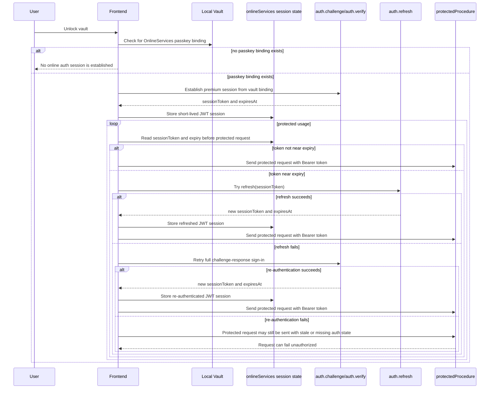
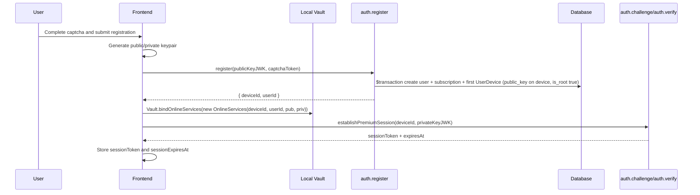
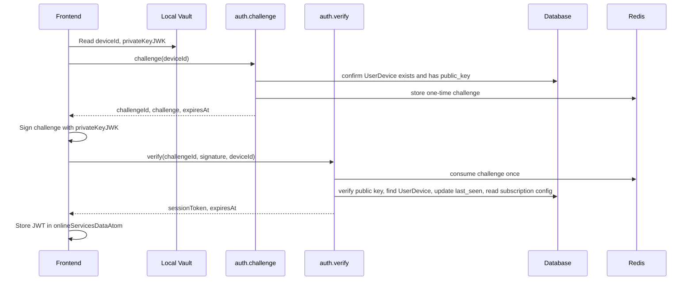
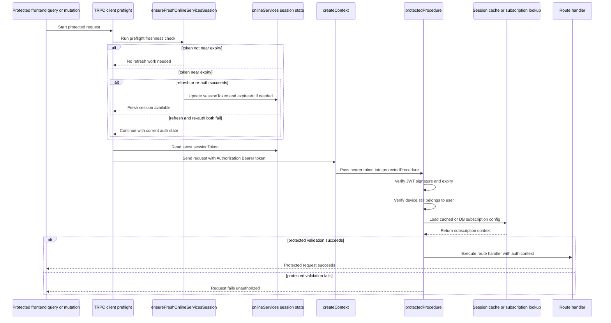
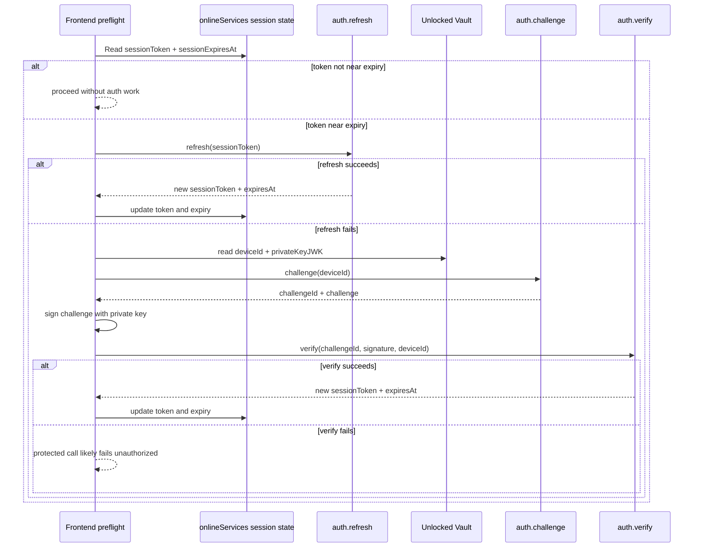
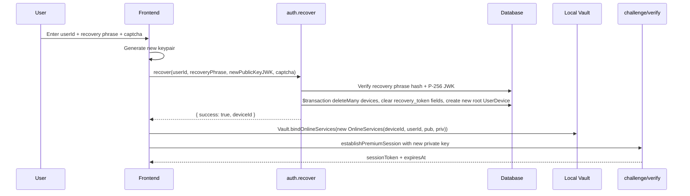
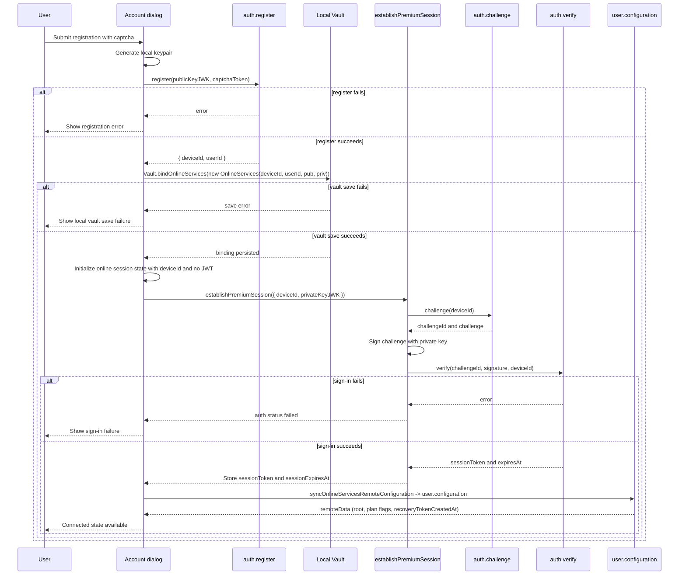
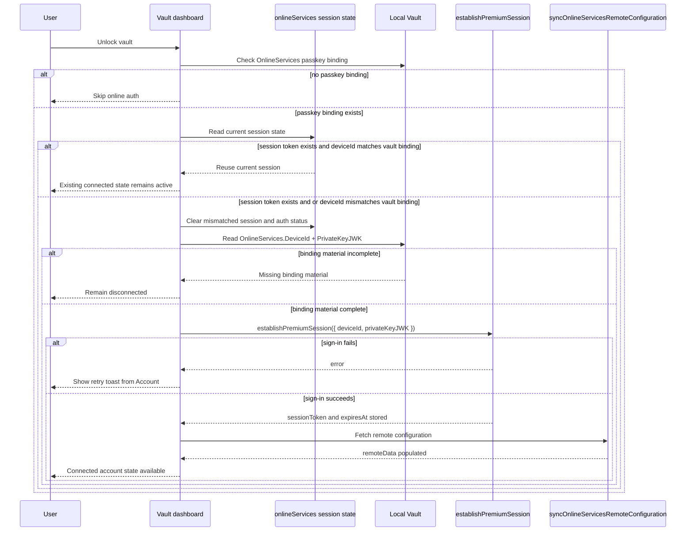
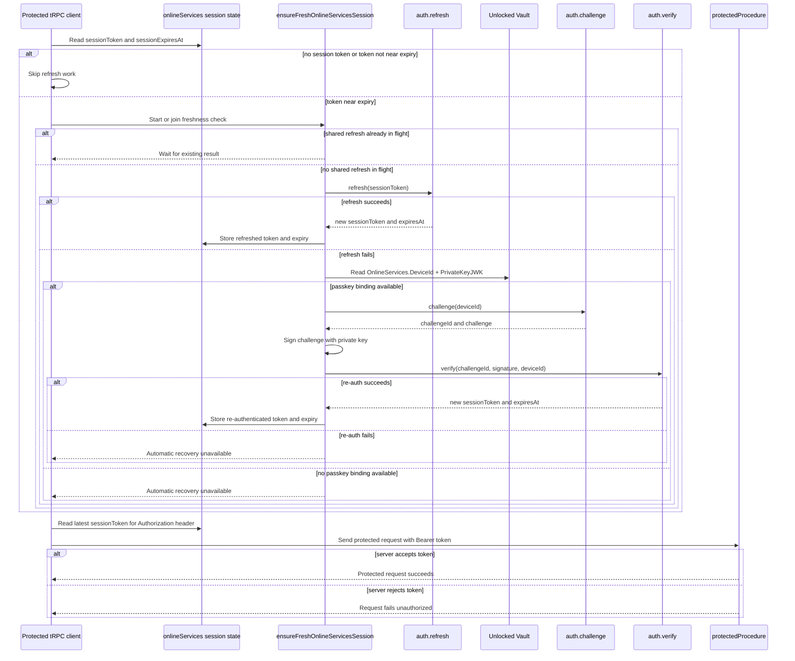

# Authentication

This document describes the current authentication model used by the `web` app for Cryptex Vault Online Services.

For the server-side API and middleware view of the same system, see [`authentication-api.md`](./authentication-api.md).

It focuses on:

- what the client stores locally
- how a user registers and signs in
- how protected API calls are authenticated
- how session refresh and fallback re-authentication work
- how recovery works
- where root-device and subscription-derived permissions come from

This is an implementation document for the current codebase, not a product-level security whitepaper.

## Terms

- `vault`: The locally unlocked Cryptex Vault object stored in the frontend.
- `OnlineServices`: The section of the vault that stores server-account binding material.
- `passkey binding`: In this codebase, this means the vault stores:
    - `DeviceId` (server-generated device id; equals **`UserDevice.id`**)
    - `UserID` (account id; equals **`User.id`**)
    - `PrivateKeyJWK`
    - `PublicKeyJWK`
    - `IsRootDevice` (cached value of the server's **`UserDevice.is_root`** for this device)
- `deviceId`: The server id stored in **`vault.OnlineServices.DeviceId`** must match **`UserDevice.id`** for **`auth.verify`** to succeed. For **`device.link`**, the sender generates a **new** key pair, calls the server with the new **public** key, and ships both keys to the peer inside the encrypted **`LinkingPackageBlob.OnlineServices`** (a full `OnlineServices` payload, including the private key).
- `session token`: A short-lived JWT used in `Authorization: Bearer <token>`.
- `protectedProcedure`: A tRPC procedure that requires a valid session token.
- `root device`: A device flagged server-side as the root for account-level privileged actions.

## High-Level Design

The authentication model is split into two layers:

1. Long-lived local binding
   The unlocked vault's `OnlineServices` stores the account binding material:

- `DeviceId` (server **`UserDevice.id`**)
- `UserID` (server **`User.id`**)
- `PublicKeyJWK`
- `PrivateKeyJWK`
- `IsRootDevice` (cached server root flag)

2. Short-lived server session
   The frontend proves possession of the private key via challenge-response and receives a short-lived JWT session token.

The local binding is persistent in the vault. The JWT is ephemeral and stored only in frontend app state.

## Stored Data

### In The Vault

The `OnlineServices` section of the vault stores the account binding:

- `DeviceId` - server **`UserDevice.id`** for this device; must exist server-side for **`auth.verify`** to succeed
- `UserID` - server **`User.id`** for the account
- `PublicKeyJWK`
- `PrivateKeyJWK`
- `IsRootDevice` - **cache** of the server's `UserDevice.is_root` value, refreshed after `user.configuration`

This is what allows the frontend to establish a new premium session later without asking the user to manually sign in again, as long as the vault is unlocked.

The vault's separate `LinkedDevices` section (peer/sync configuration, STUN/TURN/signaling lists) is not used by the authentication flow.

### In Frontend Session State

The frontend keeps session state in `onlineServicesStore` / `onlineServicesDataAtom`:

- `deviceId` (matches JWT subject / server device)
- `sessionToken`
- `sessionExpiresAt`
- `remoteData`

`remoteData` is server-derived account metadata such as:

- whether the current device is root
- linking limits and permissions
- subscription-derived capabilities
- recovery-token presence metadata

### On The Server

The server persists:

- the user record (recovery hash only; **no** account-level passkey field)
- user-device records with **`public_key` per device** (Prisma generates `UserDevice.id` via its `@default(cuid())`; `auth.recover` explicitly overrides with `ulid()`). `public_key` is `@unique` so the same JWK cannot register twice.
- device relationships (`DeviceRelationship`) created by `device.link` between an existing root device and the newly minted linked device
- subscription configuration
- recovery token hash and creation timestamp

The server also uses Redis for:

- one-time auth challenges
- cached subscription/session-derived data

## Main Components

### Frontend

- `web/src/app_lib/auth-session.ts`
  Owns challenge-response sign-in, refresh, lazy preflight freshness checks, and refresh fallback re-authentication.
- `web/src/utils/trpc.ts`
  Attaches the bearer token and runs the shared preflight freshness hook before protected traffic.
- `web/src/components/vault-dashboard/vault-dashboard.tsx`
  Performs automatic sign-in when a vault with passkey binding is opened.
- `web/src/components/vault-dashboard/account-dialog.tsx`
  Handles registration, recovery, account management, and post-auth configuration refresh.

### Backend

- `web/src/server/trpc/routes/v1/auth.router.ts`
  Defines `register`, `challenge`, `verify`, `refresh`, and `recover`.
- `web/src/server/trpc/trpc.ts`
  Defines `protectedProcedure` middleware that validates bearer JWTs and derives request auth context.
- `web/src/server/auth/challenge.ts`
  Creates and consumes one-time challenges and verifies signatures.
- `web/src/server/auth/jwt.ts`
  Signs and verifies session JWTs.
- `web/src/server/auth/session-cache.ts`
  Caches subscription-derived session data in Redis.
- `web/src/server/trpc/routes/v1/user.router.ts`
  Exposes protected account configuration and recovery-token operations.

## End-To-End Model

At a high level:

1. Registration creates a server user record and a **root `UserDevice`** row holding the passkey **public** key.
2. The frontend stores the full passkey binding in the vault.
3. Sign-in uses challenge-response:

- server issues challenge
- frontend signs challenge with vault private key
- server verifies signature against stored public key
- server issues short-lived JWT

4. Protected tRPC procedures require that JWT in `Authorization: Bearer`.
5. Before protected requests, the client checks whether the JWT is near expiry.
6. If near expiry, the client first tries `auth.refresh`.
7. If refresh fails, the client falls back to a full challenge-response re-authentication using the unlocked vault’s passkey material.

## Authentication Lifecycle

## Registration Flow

Registration creates a new server user and binds that account into the local vault.

### Frontend Steps

In `AccountDialog`:

1. User completes captcha.
2. Frontend generates a new keypair locally.
3. Frontend sends `publicKeyJWK` and captcha token to `v1.auth.register`.
4. Server runs a Prisma `$transaction`: creates the `User`, upserts a standard `Subscription`, creates the first `UserDevice` (root) with `public_key`, and returns **`{ deviceId, userId }`**.
5. Frontend builds `new OnlineServices(deviceId, userId, publicKeyJWK, privateKeyJWK)` and calls `Vault.bindOnlineServices(vault, onlineServices)`.
6. Frontend saves the updated vault.
7. Frontend sets temporary online-services session state with no JWT yet.
8. Frontend calls `establishPremiumSession({ deviceId, privateKeyJWK })`.
9. Frontend fetches remote configuration via `syncOnlineServicesRemoteConfiguration()`.

### Registration Diagram

### Important Notes

- The server never receives the private key.
- The private key lives in the local vault binding.
- The server assigns **`deviceId`** (Prisma `@default(cuid())` on `UserDevice.id`) and returns it together with the new **`userId`**; the client must persist both into `OnlineServices` before **`establishPremiumSession`** / **`auth.verify`**.
- The transaction also ensures the `Subscription` row exists; without it `auth.verify` would later fail with `INTERNAL_SERVER_ERROR` "Subscription not configured."
- Registration does not by itself create a durable browser session cookie.
- The authenticated session after registration is still a JWT bearer token obtained through challenge-response.

## Sign-In Flow

Sign-in means establishing a premium session JWT from the existing vault binding.

### When It Happens

It currently happens automatically from `VaultDashboard` when:

- the vault is unlocked
- `Vault.isOnlineServicesBound(vault)` is true
- there is no already-valid matching session in frontend state

It can also be reached indirectly after registration or recovery.

### Frontend Logic

The dashboard `ensureSession` effect does this:

1. Read `vault.OnlineServices`; bail out if absent.
2. If a session token already exists and `data.deviceId !== vault.OnlineServices.DeviceId`, clear the frontend online-services session state (mismatched binding).
3. If a session token already exists and matches, return early - keep the live session.
4. Otherwise:

- call `establishPremiumSession({ deviceId, privateKeyJWK })`
- then call `syncOnlineServicesRemoteConfiguration()`

### Challenge-Response Steps

`establishPremiumSession()` performs:

1. Call `v1.auth.challenge` with `deviceId`
2. Decode returned challenge bytes
3. Sign challenge with the locally stored private key
4. Call `v1.auth.verify` with:

- `challengeId`
- `signature`
- `deviceId`

5. Receive:

- `sessionToken`
- `expiresAt`

6. Store both in frontend session state
7. Mark online-services connection status as connected

### Sign-In Diagram

## Protected Request Flow

Protected tRPC procedures are guarded by `protectedProcedure`.

### What The Frontend Sends

The frontend sends:

- `Authorization: Bearer <sessionToken>`

The header is assembled by `createBareAuthHeader()` (in `web/src/app_lib/auth-session.ts`) and wrapped by `createHeadersWithFreshSession()` in `web/src/utils/trpc.ts`, which runs the preflight freshness check first.

### What The tRPC Client Does Before A Protected Call

Before any non-`v1.auth.*` batch is sent:

1. `createHeadersWithFreshSession(opList)` runs.
2. If the batch includes non-auth procedures, it calls `ensureFreshOnlineServicesSession()`.
3. After that check completes, it attaches the current bearer token from state.

This means:

- there is no timer-based background refresh
- the app only refreshes or re-authenticates when protected traffic is about to happen

### Protected Middleware Steps

For a `protectedProcedure`, the server:

1. Parses the `Authorization` header in `createContext()`
2. Verifies the JWT signature and expiry
3. Extracts:

- `sub` as **device id** (`UserDevice.id`)
- `root` as a cached device-root hint from the token

4. Confirms the device row still exists; resolves **`user_id`** for subscription
5. Loads subscription configuration:

- from Redis cache if present
- otherwise from the database and then re-caches it

6. Enriches the request context with:

- `user.id`
- `deviceId`
- `rootDevice`
- `subscriptionConfig`
- `rateLimitKey`

### Protected Request Diagram

## Refresh And Re-Authentication

This is one of the most important parts of the current implementation.

### Current Strategy

The app does not refresh sessions on a timer anymore.

Instead:

- just before protected traffic, the client checks whether `sessionExpiresAt` is within a lead window
- if yes, it tries to refresh
- if refresh fails, it tries a full passkey-based re-authentication

### Lead Window

`auth-session.ts` currently uses:

- `SESSION_REFRESH_LEAD_MS = 60_000`

That means a token is considered stale-enough when it has 60 seconds or less remaining.

### Refresh Flow

`refreshOnlineServicesSession()`:

1. Reads the existing token from `onlineServicesStore`
2. Calls `v1.auth.refresh({ sessionToken })`
3. On success, replaces:

- `sessionToken`
- `sessionExpiresAt`

### Why Refresh Can Fail

Refresh can fail when:

- the JWT is already expired
- the JWT is invalid
- the device no longer exists
- the user no longer has usable subscription configuration

### Fallback Re-Authentication Flow

If refresh fails, `ensureFreshOnlineServicesSession()` calls `reauthenticateOnlineServicesSession()`.

That function:

1. Reads the unlocked vault via `getUnlockedVault()`
2. Verifies the vault is still bound (`Vault.isOnlineServicesBound(vault)`)
3. Extracts:

- `vault.OnlineServices.DeviceId`
- `vault.OnlineServices.PrivateKeyJWK`

4. Calls `establishPremiumSession({ deviceId, privateKeyJWK })`

This gives the app a second chance to recover automatically as long as:

- the vault is unlocked
- the binding still exists
- the stored private key still matches the server’s current public key

### Deduplication

`ensureFreshOnlineServicesSession()` uses `refreshInFlight` to deduplicate concurrent stale-session checks.

This prevents a burst of queries from causing:

- multiple simultaneous refreshes
- multiple simultaneous challenge-response re-auth attempts

### Refresh / Re-Auth Diagram

## Why `auth.refresh` And Full Re-Auth Both Exist

They solve different problems:

- `auth.refresh`
  Extends a still-valid session token cheaply without doing a full challenge-response cycle.
- full re-authentication
  Recovers when refresh cannot succeed anymore, especially after expiry.

Because `auth.refresh` verifies the incoming JWT before issuing a new one, it cannot revive an already-expired token. That is why the fallback re-auth path is necessary.

## Server-Side JWT Contents

The JWT currently contains:

- subject (`sub`): **device id** (`UserDevice.id`)
- `root`: whether the device was root when the token was signed

There is **no** separate `did` claim; the account user is inferred from the device row.

The token is signed with:

- algorithm: `HS256`

The token expiry is controlled by:

- `SESSION_TOKEN_EXPIRY_SECONDS`

Even though the token carries a `root` claim, the server still re-checks the current device record on protected requests and refresh, so the live server-side device state remains authoritative.

## Challenge Mechanics

Challenges are generated and consumed through Redis.

### Challenge Creation

`createAuthChallenge(deviceId)`:

- generates a random `challengeId`
- generates random challenge bytes
- stores `{ deviceId, challengeB64 }` in Redis
- returns the challenge plus its expiration time

### Challenge Consumption

`consumeAuthChallenge(challengeId)`:

- atomically reads and deletes the challenge in Redis through Lua
- ensures the same challenge cannot be reused

### Signature Verification

The server verifies:

- ECDSA P-256
- SHA-256
- `ieee-p1363` signature encoding

The client signs the raw challenge bytes using the local private key JWK.

## Recovery Flow

Recovery is the account-binding reset path, not a JWT refresh path.

It is used when the user has:

- a `userId`
- a recovery phrase
- no usable original passkey binding

### Frontend Recovery Steps

In `AccountDialog`:

1. User enters:

- account `userId`
- recovery phrase
- captcha

2. Frontend generates a new local keypair
3. Frontend calls `v1.auth.recover` with:

- `userId`
- `recoveryPhrase`
- `newPublicKeyJWK`
- `captchaToken`

4. Server verifies the recovery phrase against the stored hash and validates the new public key (P-256 EC JWK)
5. In a single Prisma `$transaction` the server **deletes all `UserDevice` rows** for that user, clears `recovery_token` / `recovery_token_created_at`, and **creates a new root `UserDevice`** (id `ulid()`, `public_key = newPublicKeyJWK`, `is_root: true`). Returns **`{ success: true, deviceId }`**.
6. Server invalidates cached session data for every device of that user (in practice only the new device id remains after the transaction).
7. Frontend builds `new OnlineServices(deviceId, recoverUserId, pub, priv)` and calls `Vault.bindOnlineServices(...)` so `DeviceId` + `UserID` are stored alongside the new keys
8. Frontend establishes a fresh premium session using the new private key
9. Frontend refreshes remote configuration

### Recovery Diagram

## Recovery Token Management

Recovery token creation and clearing are protected operations exposed through `user.router`.

### Generate Recovery Token

`v1.user.generateRecoveryToken`:

- requires a protected session
- requires `ctx.rootDevice === true`
- generates a 256-bit BIP39 mnemonic
- hashes it with Argon2id
- stores only the hash server-side
- returns the plaintext phrase once

### Clear Recovery Token

`v1.user.clearRecoveryToken`:

- requires a protected session
- requires root device
- removes the stored recovery token hash and timestamp

### Frontend Behavior

After either generating or clearing a recovery phrase, the frontend refreshes remote account configuration so the UI reflects the latest recovery-token status.

## Account Configuration Fetch

`v1.user.configuration` is a protected procedure and is the main "who am I and what can I do?" endpoint for the frontend.

It returns:

- `deviceId` (this JWT’s device)
- `root`
- `canLink`
- `maxLinks`
- `canPromoteDevices`
- `alwaysConnected`
- `canFeatureVote`
- `recoveryTokenCreatedAt`

The frontend uses this as the authoritative source for:

- root-device status
- account capability flags
- recovery-token presence

## Device Identity And Root Status

**Device ids are created only on the server**. The Prisma schema sets `UserDevice.id @default(cuid())`, so most creation paths get an auto-generated cuid; `auth.recover` is the one path that explicitly passes a `ulid()`. Devices are created in:

- **`auth.register`** - creates the first (root) device for a new account inside a `$transaction`, returns **`{ deviceId, userId }`**.
- **`auth.recover`** - inside a `$transaction`, deletes every existing `UserDevice` for the user, clears recovery-token fields, and creates a new root device with a fresh `ulid()`. Returns **`{ success, deviceId }`**.
- **`device.link`** (authenticated, root caller, within plan `linking_allowed` / `max_links`) - inside a `$transaction`, creates an additional non-root device and a `DeviceRelationship` row, returns **`{ deviceId, syncId }`** where `syncId` is the relationship row id.

The client stores `deviceId` (and `userId`) in **`OnlineServices`** and sends **`deviceId`** on **`auth.verify`**. The server **does not create** `UserDevice` rows inside verify: it **finds** the row by **`id`** and **updates `last_seen`** only. If there is no row or the signature does not match **`UserDevice.public_key`**, verify fails. **`is_root`** on the JWT comes from **`UserDevice.is_root`** for that row.

On each protected request and refresh, the server re-checks the device row. So even though the JWT includes `root`, the server does not trust the token claim alone for privileged actions.

### Multiple root devices

The data model allows **more than one** `UserDevice` with `is_root: true`. **`device.setRoot`** can promote or demote any device the caller is allowed to touch, subject to subscription **`promoting_to_root`**. The only hard rule is **you cannot demote the last root device** (the account would have no device able to manage links, recovery, or deletion).

Product meaning: several devices may hold root privileges at once (e.g. a laptop and a phone both “admin”). That is intentional; it is not “exactly one root worldwide.”

### Cached root flag in the vault

**`OnlineServices.IsRootDevice`** in the encrypted vault is a **cache** of whether **this** device id is root on the server. It is updated when the client refreshes remote configuration after sign-in. **Authorization always uses the server**, not this field.

### Linking a new device (Online Services)

To add a device under the same account with a **distinct** passkey pair:

1. The **sender** generates a new P-256 key pair locally.
2. The sender calls **`device.link`** with **`publicKeyJWK`**; in a single `$transaction` the server creates a new non-root **`UserDevice`** row (with that `public_key`) and a **`DeviceRelationship`** row pairing the caller's `deviceId` to the new one. The mutation returns **`{ deviceId, syncId }`**, where `syncId` is the relationship row id used for sync correlation.
3. The sender builds a full **`OnlineServices`** payload for the peer: `new OnlineServices(deviceId, vault.OnlineServices.UserID, publicKeyJWK, privateKeyJWK, isRoot)` - the peer must carry **its own private key** to sign future challenges.
4. **`packageForLinking`** writes a **`LinkingPackageBlob`** containing **`SyncID`**, the peer's **`OnlineServices`**, plus the curated **`STUNServers`**, **`TURNServers`**, and **`SignalingServer`** lists. The blob is encrypted before being sent over WebRTC.
5. If the UI requested the linked device be promoted to root, the sender calls **`device.setRoot`** right after `device.link`; failure triggers a rollback via `device.remove`.

The **receiver** opens the encrypted blob, installs the embedded `OnlineServices` into its own vault (with the peer-minted `DeviceId`), and seeds frontend session state from that `DeviceId` for JWT-backed calls.

## Automatic Sign-In On Vault Open

When the vault dashboard loads, the app automatically tries to establish a session if:

- the vault is unlocked
- passkey binding exists in the vault

### Current Behavior

If there is already a session token in frontend state:

- and the session `deviceId` matches `vault.OnlineServices.DeviceId`, the dashboard leaves it alone
- if they differ, it clears the current frontend online-services session state and signs in again from the vault binding

This protects against stale frontend session state if the local vault binding changes.

## Sign-Out And Local Unbinding

There is no dedicated server-side logout endpoint for the JWT session.

Current practical sign-out behavior is local:

- clear frontend session state
- clear online-services connection status
- optionally remove passkey binding from the vault

### Locking The Vault

When the vault is locked, the app:

- clears the vault secret from browser session storage
- clears online-services auth status
- clears online-services session data
- resets unlocked vault state

### Remove Local Binding

The account dialog can remove only the local binding:

- it clears frontend session/auth state
- it unbinds `OnlineServices` from the local vault
- it saves the vault

This does not delete the server account.

### Delete Account

Deleting the account is a protected root-device action:

- frontend calls `v1.user.delete`
- frontend unbinds local `OnlineServices`
- frontend saves the vault
- frontend clears session state

## Authorization Model

The authentication layer provides the basis for authorization by enriching request context with:

- current user id
- current device id
- current root-device status
- current subscription configuration

Route handlers then use these to enforce permissions such as:

- only root devices may generate or clear recovery tokens
- only root devices may delete the user
- device-management and billing routes can rely on current subscription/device state

## Error And Failure Modes

### Missing Bearer Token

Protected procedures fail with `UNAUTHORIZED` when no bearer token is sent.

### Expired Or Invalid JWT

Protected procedures fail with `UNAUTHORIZED` if:

- JWT signature is invalid
- JWT is expired
- token payload is malformed

### Device No Longer Exists

Even with a valid JWT, requests fail if the referenced **`UserDevice`** row no longer exists (`sub` is device id).

### No Subscription Configuration

Protected requests and refresh fail if the user no longer has valid subscription configuration.

### Missing Local Passkey Material

Automatic re-authentication cannot happen if the unlocked vault is missing:

- `OnlineServices.DeviceId`
- `OnlineServices.PrivateKeyJWK`

(i.e. `Vault.isOnlineServicesBound(vault)` returns false). In that case, a protected request near expiry cannot recover automatically through full re-auth.

### Unknown User During Challenge

`auth.challenge` rejects requests for unknown **`UserDevice`** ids or devices with no **`public_key`** on record.

### Invalid Signature

`auth.verify` rejects invalid passkey signatures.

### Expired Challenge

`auth.verify` rejects stale, missing, or already-consumed challenges.

## Security Properties Of The Current Design

### Good Properties

- The server stores only the public key, not the private key.
- Session JWTs are short-lived.
- Challenges are one-time and atomically consumed.
- Root-device status is re-checked server-side.
- Subscription-derived auth context is reloaded or refreshed on the server.
- The client does not keep a refresh timer hammering the server while idle.

### Trade-Offs

- The session token is stored in frontend state, not in an `httpOnly` cookie.
- As long as the vault is unlocked and still contains passkey material, the frontend can re-establish a session automatically.
- There is no dedicated logout-revocation mechanism for already-issued JWTs beyond expiry and the device/user checks on use.

## Current Sequence Summaries

### Register

### Auto Sign-In

### Preflight Freshness Check

## Practical Notes For Future Changes

- If you add new protected routes, they automatically inherit the shared preflight freshness behavior as long as they use the standard tRPC clients from `web/src/utils/trpc.ts`.
- If you add new auth bootstrap routes, keep them under `v1.auth.*` unless they truly need the preflight hook.
- If you add new privileged actions, rely on server-side `ctx.rootDevice` and not on the JWT `root` claim alone.
- If you change the session-expiry model, review:
    - `SESSION_TOKEN_EXPIRY_SECONDS`
    - `SESSION_REFRESH_LEAD_MS`
    - `auth.refresh`
    - `ensureFreshOnlineServicesSession()`
- If you change the vault binding model, review:
    - `Vault.bindOnlineServices` / `Vault.unbindOnlineServices`
    - `Vault.isOnlineServicesBound`
    - the `OnlineServices` class fields (`DeviceId`, `UserID`, `PublicKeyJWK`, `PrivateKeyJWK`, `IsRootDevice`)
    - dashboard auto sign-in
    - fallback re-authentication

## Source Map

- Frontend session orchestration: `web/src/app_lib/auth-session.ts`
- Frontend tRPC auth headers: `web/src/utils/trpc.ts`
- Auto sign-in on vault open: `web/src/components/vault-dashboard/vault-dashboard.tsx`
- Registration and recovery UI: `web/src/components/vault-dashboard/account-dialog.tsx`
- Auth routes: `web/src/server/trpc/routes/v1/auth.router.ts`
- Protected middleware: `web/src/server/trpc/trpc.ts`
- User configuration and recovery-token routes: `web/src/server/trpc/routes/v1/user.router.ts`
- JWT signing and verification: `web/src/server/auth/jwt.ts`
- Challenge generation and verification: `web/src/server/auth/challenge.ts`
- Session cache: `web/src/server/auth/session-cache.ts`
