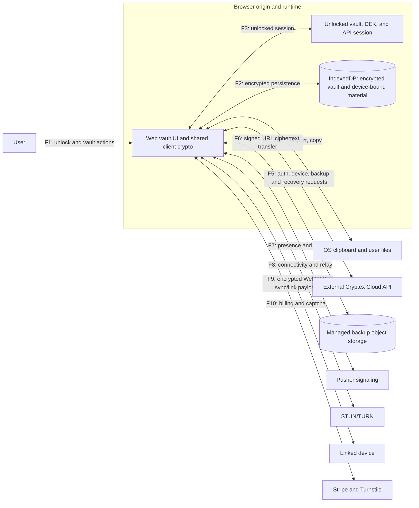

# Web app threat model

| Field                      | Value                                                                   |
| -------------------------- | ----------------------------------------------------------------------- |
| Product                    | Cryptex Vault web app                                                   |
| Document revision          | 1.0                                                                     |
| Updated                    | September 2026                                                          |
| Audience                   | Engineering and security reviewers                                      |
| Status                     | Internal engineering review                                             |
| Risk owners and acceptance | Unassigned unless recorded below; acceptance requires an assigned owner |

## 1. Purpose and method

Cryptex Vault is a local-first password manager. The web app stores an encrypted vault in the browser and decrypts it locally after unlock. Optional services support account operations, device linking, synchronization, and encrypted backups.

This document uses the [OWASP threat modeling process](https://cheatsheetseries.owasp.org/cheatsheets/Threat_Modeling_Cheat_Sheet.html): describe the system, identify threats, record mitigations, and review the result. STRIDE classifies the threat scenarios.

This internal review covers the web app and its shared client code. Code references identify the implementations relevant to each control. Backend enforcement and deployed-service behavior require separate validation.

## 2. Scope and security objectives

### Scope

| In scope                                                                            | Outside this assessment                                                                    |
| ----------------------------------------------------------------------------------- | ------------------------------------------------------------------------------------------ |
| Web UI, vault lifecycle, browser memory, and IndexedDB                              | Extension and native mobile internals                                                      |
| Shared vault crypto and sync/link code used by the web app                          | Hosted Cloud API implementation and operations                                             |
| Shared UI and API contracts used by the web app                                     | Server-side authentication, revocation, billing, and retention enforcement                 |
| Web calls to Cloud API, signaling, STUN/TURN, Stripe, Turnstile, and backup storage | Third-party infrastructure internals                                                       |
| Import, export, clipboard, recovery, and logging                                    | Support operations, social recovery, and other human processes outside this repository     |
| Client deployment configuration in the Docker Compose files                         | Compromised operating system, browser, browser profile, or malware reading unlocked memory |

Extension and mobile devices can be sync/link peers. Their internal controls are not web-app controls. See the [extension threat model](../extension/docs/threat-model.md) for that client.

### Security objectives

1. Keep persisted vault contents encrypted. A locked web vault must not retain its master password or usable DEK in application state.
2. Derive unlock keys locally. Configured cloud, signaling, payment, and captcha services should not receive the master password or vault plaintext.
3. Authenticate and encrypt sync/link payloads independently of the transport services.
4. Limit the lifetime of unlocked secrets through explicit lock and idle lock.
5. Keep cloud recovery authorization separate from vault decryption. Access to backup ciphertext must not itself unlock the vault.

### Deployment assumptions and limits

- Local-only mode uses `NEXT_PUBLIC_CLOUD_ENABLED=false`. Cloud-enabled deployments may contact the services listed in section 8.
- Configured app, API, Pusher, and TURN URLs identify the intended services. The model relies on the browser's origin isolation and applicable content security policy behaving correctly.
- Web Crypto, IndexedDB, libsodium, `@noble/post-quantum`, and `@scure/bip39` behave correctly for the operations used here.
- Users choose sufficiently strong master passwords and protect recovery codes and linking mnemonics.
- Locked-state protection assumes the attacker has not already captured unlock material. Encryption at rest cannot protect plaintext from a compromised runtime while unlocked.
- Developers use test accounts and disposable vault data when verbose development logging is enabled.
- Backend security claims require separate evidence. Client code and API contracts cannot prove server enforcement or operational controls.

This review does not establish compliance with a regulatory framework or deployment certification.

## 3. Assets and secret lifecycle

| ID  | Asset                                            | Location or lifetime                                              | Consequence of exposure                                                                            |
| --- | ------------------------------------------------ | ----------------------------------------------------------------- | -------------------------------------------------------------------------------------------------- |
| A1  | Vault plaintext                                  | Web memory while unlocked                                         | Credentials, TOTP secrets, notes, groups, linked-device data, and Online Services material exposed |
| A2  | Encrypted vault blob                             | IndexedDB `vaultDB.vaults`; downloaded or managed `.cryx` backups | Offline password guessing; ciphertext size and history disclosed                                   |
| A3  | Master password and KEK material                 | Unlock/create input and key derivation operations                 | DEK unwrapping or rewrapping                                                                       |
| A4  | Data encryption key, DEK                         | Web module memory while unlocked                                  | Vault decryption                                                                                   |
| A5  | Vault recovery code                              | Creation/rotation display and user-controlled storage             | Recovery-slot unlock                                                                               |
| A6  | Device-bound second-factor material              | IndexedDB `vaultKeyStore`                                         | Additional material used to unlock a protected vault on the same device                            |
| A7  | Online Services device private key               | Encrypted vault; available to client code after unlock            | Device impersonation through signed authentication challenges                                      |
| A8  | Online Services JWT                              | Web memory/Jotai session state                                    | Authorized API access until expiry or revocation                                                   |
| A9  | Sync/link keys and custom signaling/TURN secrets | Vault linked-device and connectivity configuration                | Peer impersonation, payload access, or service use                                                 |
| A10 | Linking mnemonic and package                     | Device-link transfer flow                                         | Mnemonic and package together permit receipt of the transferred vault                              |
| A11 | Online Services Recovery Kit                     | Recovery dialog and user-controlled offline storage               | Root-backup recovery authorization and destructive account recovery                                |
| A12 | Managed-backup recovery session token            | Ephemeral browser session                                         | Five-minute list/download access to eligible root ciphertext                                       |
| A13 | Captcha token                                    | Ephemeral UI and API request                                      | Bot-protection proof exposed or reused                                                             |
| A14 | Clipboard, exports, and logs                     | OS clipboard, browser downloads, console                          | Secrets or metadata escape the vault's storage controls                                            |

| State    | Expected secret handling                                                               | Remaining exposure                                                                             |
| -------- | -------------------------------------------------------------------------------------- | ---------------------------------------------------------------------------------------------- |
| Locked   | Persist encrypted vault bytes; clear master-password and DEK references from app state | Offline guessing against stolen ciphertext; user-held recovery material                        |
| Unlocked | Hold plaintext and sufficient key material to display, edit, copy, sync, and save      | Same-origin script, malicious extensions, local access, screen capture, and runtime compromise |

JavaScript zeroization is best effort. Immutable strings, engine copies, library buffers, and garbage-collected Web Crypto keys cannot be synchronously erased by application code.

## 4. Architecture and data flows

The diagram shows logical flows. TURN may relay peer traffic. Signaling and relay services still observe connection metadata even when application payloads are encrypted.

## 5. Trust boundaries and attacker capabilities

| Boundary                                      | Flows       | Documented controls                                                                              | Residual risk                                                                                     |
| --------------------------------------------- | ----------- | ------------------------------------------------------------------------------------------------ | ------------------------------------------------------------------------------------------------- |
| B1: Web runtime and persisted browser data    | F2, F3      | Encrypt vault before IndexedDB save; retain DEK in module memory only while unlocked             | Stolen ciphertext permits offline guessing; same-origin compromise while unlocked exposes secrets |
| B2: Web app and external services             | F5, F6, F10 | Optional cloud mode, device challenge signing, client-side backup encryption and transfer checks | Server enforcement is external; JWT theft permits API use; providers see metadata                 |
| B3: Web app and peer/transport infrastructure | F7, F8, F9  | Authenticated payload encryption, signed sync setup, encrypted mnemonic-protected link package   | Malformed authenticated peer data, leaked mnemonic, service disruption, and metadata disclosure   |
| B4: Vault and user/OS surfaces                | F1, F4      | Explicit/idle lock, encrypted persistence after import, controlled UI actions                    | Clipboard, screen capture, and exported files remain outside vault control                        |

Relevant attackers include a thief with a copy of IndexedDB or a backup, a script executing in the unlocked app, a malicious browser extension, an observer or disruptor of signaling/relay traffic, an authenticated malicious peer, and an attacker holding a JWT, Recovery Kit, or linking phrase. Their capabilities differ: possession of ciphertext alone is not possession of a decryption key.

## 6. Controls by operation

### Create, unlock, save, and lock

- Envelope vaults use a random AES-GCM DEK for vault contents and AES-256-KW to wrap the DEK.
- The primary KEK derives from Argon2id over the master password, with optional second-factor material through HKDF-SHA-256. Argon2id defaults are 256 MiB and three operations, and legacy PBKDF2 support at 200,000 iterations.
- A separate recovery slot derives from a generated 256-bit BIP39 recovery code.
- Operation-scoped KEK references are disposed. Non-extractable Web Crypto keys have no explicit destruction API.
- Web unlock retains the DEK through `vault-session.ts`. The documented lock flow saves with that DEK, tears down sync, clears the DEK and Online Services state, and resets unlocked vault state.
- Inactivity auto-lock defaults to 15 minutes and uses user activity events.

Weak passwords still permit offline guessing. Browser storage integrity, cryptographic implementations, KDF settings, and runtime isolation remain assumptions.

### Sync and device linking

- Pusher presence channels provide signaling; WebRTC carries peer traffic. Sync channels use `presence-sync-{syncID}`. Connectivity uses configured STUN/TURN servers or Cloud-provided TURN credentials.
- Sync keys reside in vault `LinkedDevices` data. Sync uses ML-KEM-768 and ML-DSA-65, with HKDF-derived AES-GCM keys and transcript-bound additional authenticated data.
- Linking encrypts the package using a 12-word BIP39 mnemonic, Argon2id, and XChaCha20-Poly1305. Its HMAC-SHA-256 uses mnemonic bytes as the MAC key.
- The linking copy removes current Online Services data, resets linked-device state, and installs sender root-device metadata for the receiver.

Signaling and TURN can observe metadata and disrupt availability. Users must protect the linking mnemonic. Authentication of a peer does not establish that its credential data is semantically valid; peer-data validation requires further review.

### Online Services authentication

- The client generates an ECDSA P-256 device-signing JWK pair and stores its private key inside the encrypted vault. This is separate from browser WebAuthn.
- Authentication obtains a challenge, signs it locally, submits the signature, and receives a JWT. It does not send the master password or private key.
- Session refresh begins within 60 seconds of token expiry. Forced reauthentication has a 30-second cooldown.
- Web session state resides in memory/Jotai state.

JWT theft grants API access until expiry or revocation. Device-key theft permits impersonation. Backend challenge validation, session storage, and revocation are outside this assessment.

### Managed backups and recovery

- Upload/download checks ciphertext length and SHA-256 around signed object-store URLs.
- Fresh-device recovery sends User ID, Recovery Kit, captcha, and a browser-generated random session token to `backup.createRecoverySession`. Subsequent list/download requests use that token.
- The recovery contract exposes server-filtered current-root snapshots. The UI recommends the newest returned snapshot and does not determine eligibility itself. Authenticated backup UI provides access to other eligible history after reconnection.
- Verified ciphertext is stored as a new local vault. Normal vault unlock still requires the vault secret and reuses the backed-up root credentials for Online Services authentication.
- Kit consumption leaves no current Kit. Root configuration reports `recoveryGenerationNeeded`; the client requests a replacement and presents a non-dismissible save-and-acknowledge dialog. Account security supports rotation, without a clear-only action.
- Snapshot labels use `Root device`, `Linked device`, or `Removed device`. Backup status exposes `none`, `pending`, `protected`, or `degraded` account recovery protection.

The recovery design requires atomic Recovery Kit consumption and recovery-session creation on the same PostgreSQL user row. This is an external backend design dependency, not a control verified by this client repository. Root eligibility, single-use enforcement, five-minute session binding, retention pinning, and signed-URL lifetime also require server-side evidence.

A stolen Kit and User ID authorize eligible ciphertext retrieval. An attacker who also has the vault password or vault recovery code can decrypt the restored vault and reclaim root control. Backup storage sees ciphertext size and timing.

### Import, export, clipboard, and logging

- Imported vault data is encrypted when saved. Plaintext imports and downloaded exports remain user-managed files outside the vault boundary.
- Web clipboard writes use `navigator.clipboard.writeText`. Web secret-copy paths do not clear the clipboard on a timer.
- Account portal windows use `noopener,noreferrer`.
- Production web tRPC logging records failure metadata without procedure inputs or response bodies; successful requests are not logged by this path.
- Development tRPC logging includes complete procedure inputs and results. Real Recovery Kits, credentials, and vaults must not be used with that logging enabled.

## 7. Threat scenarios and existing risk register

STRIDE categories are spoofing, tampering, repudiation, information disclosure, denial of service, and elevation of privilege. The following scenarios identify affected assets, trust boundaries, controls, and residual risks.

| ID  | STRIDE                                         | Scenario and affected assets                                                                        | Boundary | Existing controls                                                                                 | Residual risk or review need                                                 |
| --- | ---------------------------------------------- | --------------------------------------------------------------------------------------------------- | -------- | ------------------------------------------------------------------------------------------------- | ---------------------------------------------------------------------------- |
| T1  | Information disclosure                         | Attacker steals A2 and guesses the master password                                                  | B1       | Argon2id, encrypted vault, wrapped DEK                                                            | Weak passwords; captured recovery/unlock material                            |
| T2  | Information disclosure, elevation of privilege | XSS, malicious extension, or local access reads A1/A4/A7/A8 while unlocked                          | B1, B4   | Runtime isolation, explicit lock, idle lock                                                       | Unlocked runtime compromise defeats vault confidentiality                    |
| T3  | Spoofing, elevation of privilege               | Attacker steals A7 or A8 and authenticates as a device                                              | B2       | Encrypted device key at rest; challenge signing                                                   | Unlocked key exposure; backend expiry/revocation enforcement                 |
| T4  | Spoofing, tampering                            | Attacker interferes with sync/link traffic or a trusted peer submits invalid data                   | B3       | Signed sync setup, AEAD with context binding, encrypted linking                                   | Peer semantic validation and mnemonic handling require review                |
| T5  | Information disclosure                         | Signaling, relay, cloud, or backup provider observes metadata                                       | B2, B3   | Payload encryption; optional cloud mode                                                           | Presence, IP addresses, identifiers, size, and timing remain visible         |
| T6  | Denial of service                              | Signaling or relay service disrupts pairing or synchronization                                      | B3       | Payload crypto preserves confidentiality/integrity during transport                               | External connectivity remains an availability dependency                     |
| T7  | Information disclosure, elevation of privilege | Kit/session theft permits backup retrieval; vault-secret theft permits decryption and root takeover | B2, B4   | Separate recovery authorization and vault secrets; limited recovery session; Kit replacement flow | Server enforcement is external; combined secret compromise                   |
| T8  | Information disclosure                         | Clipboard, exports, or development logs expose A1/A5/A10/A11                                        | B4       | Encrypted persistence; limited production tRPC logging                                            | User files and clipboard are outside vault control; verbose development logs |

Repudiation remains unassessed. This review does not establish an audit-evidence control.

### Open risks

Priorities are qualitative engineering judgments, not CVSS scores. Per-risk likelihood and impact scores, review dates, and acceptance authorities have not been assigned. Extension-only and mobile-only risks are outside this document's scope.

| ID  | Priority | Risk                                                                                     | Status                       | Owner      | Next action                                                                                            |
| --- | -------- | ---------------------------------------------------------------------------------------- | ---------------------------- | ---------- | ------------------------------------------------------------------------------------------------------ |
| R5  | Medium   | Web secret copies are not automatically cleared from the clipboard                       | Open                         | Unassigned | Add optional timed clearing where browser support and UX allow                                         |
| R6  | Medium   | Link security depends on a 12-word mnemonic; MAC uses mnemonic bytes directly            | Needs review                 | Unassigned | Review mnemonic entropy and MAC key derivation; determine whether a separate derived MAC key is needed |
| R8  | Medium   | Client UX can imply backend guarantees that this repository cannot establish             | Needs decision               | Unassigned | Keep claims conditional and link separate backend assurance when available                             |
| R9  | Low      | Development tRPC logs include full inputs/results when real accounts or secrets are used | Documented; enforcement open | Unassigned | Keep real secrets out of development builds; consider automated redaction                              |

## 8. External services and privacy

| Service              | Purpose                                                                                                                        | Visible data or metadata                                                                                                                                                        |
| -------------------- | ------------------------------------------------------------------------------------------------------------------------------ | ------------------------------------------------------------------------------------------------------------------------------------------------------------------------------- |
| Cryptex Cloud API    | Authentication, devices, configuration, billing, feedback, feature voting, signaling auth, TURN credentials, backups, recovery | Account/device IDs, JWTs, signed challenges, procedure names, timing, device relationships, backup sizes/checksums/source labels, recovery requests, and non-vault product data |
| Object storage       | Signed-URL encrypted backup transfers                                                                                          | Ciphertext, size, and transfer timing                                                                                                                                           |
| Pusher/signaling     | Sync/link negotiation                                                                                                          | Channel names, presence, timing, and connection metadata                                                                                                                        |
| STUN/TURN            | Peer connectivity and relay                                                                                                    | IP/network metadata and relay usage                                                                                                                                             |
| Stripe               | Checkout and customer portal                                                                                                   | Billing session, customer, and payment metadata                                                                                                                                 |
| Cloudflare Turnstile | Signup, recovery, and feedback bot protection                                                                                  | Captcha token and browser interaction metadata                                                                                                                                  |

The client design does not require sending vault plaintext or the master password to these services. Sync/link payload encryption is separate from signaling and relay transport. This repository does not verify provider logs, retention, access controls, or private backend code.

## 9. Review and validation

Review this model when encryption, KDFs, key slots, recovery, second factors, browser storage, session lifetime, sync/link protocols, API authentication, or external-service configuration changes. Clipboard, import/export, logging, backup behavior, and local-only/cloud deployment defaults also require review.

For each change, record whether it exposes plaintext while locked, extends unlocked-secret lifetime, crosses a trust boundary, adds provider-visible metadata, or changes an existing risk. Assign an owner before treating an unresolved risk as accepted.

Validation should reference evidence for the relevant flow: code review, negative-path tests, deployment checks, or a separate backend assessment. The review includes static code inspection. Runtime tests could not run because dependencies were not installed in the review worktree. Deployed-service behavior has not been tested.

## 10. References

All paths below are relative to this document.

- [Repository overview](../README.md), [production deployment](../compose.prod.yaml), and [development deployment](../compose.dev.yaml).
- [Client environment configuration](src/env/public.ts).
- [Shared vault implementation](../packages/vault-core/src/vault-utils/vault.ts), [envelope encryption](../packages/vault-core/src/vault-utils/envelope-encryption.ts), and [key protection](../packages/vault-core/src/vault-utils/additional-key-protection.ts).
- [Vault persistence](docs/vault-persistence.md), [storage adapter](src/app_lib/vault-utils/storage.ts), [session DEK](src/utils/vault-session.ts), [lock](src/utils/vault-lock.ts), and [auto-lock](src/utils/vault-auto-lock.ts).
- [Synchronization](../packages/vault-core/src/synchronization.ts), [sync crypto](../packages/vault-core/src/vault-utils/sync-crypto.ts), and [linking](../packages/vault-core/src/vault-utils/linking.ts).
- [Authentication](docs/authentication.md), [authentication API](docs/authentication-api.md), [web auth session](src/app_lib/auth-session.ts), and [API contract](../packages/api-contract/src/router.ts).
- [Managed backups](docs/managed-backups.md), [transfer implementation](src/app_lib/managed-backups.ts), and [restore UI](src/components/vault-manager/restore.tsx).
- [Clipboard helper](src/utils/clipboard.ts) and [tRPC logging](src/utils/trpc.ts).
